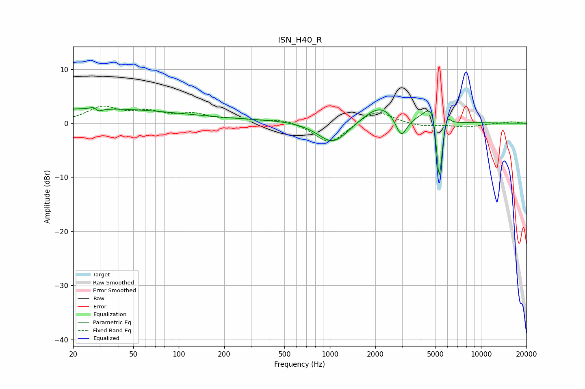

# ISN_H40_R
See [usage instructions](https://github.com/jaakkopasanen/AutoEq#usage) for more options and info.

### Parametric EQs
Apply preamp of -3.0 dB when using parametric equalizer.

|   # | Type    |   Fc (Hz) |    Q |   Gain (dB) |
|-----|---------|-----------|------|-------------|
|   1 | Peaking |        26 | 0.23 |         2.7 |
|   2 | Peaking |        28 | 5.82 |         2.5 |
|   3 | Peaking |        28 | 5.51 |        -2.6 |
|   4 | Peaking |       613 | 0.22 |         0.6 |
|   5 | Peaking |      1051 | 1.38 |        -4.4 |
|   6 | Peaking |      2157 | 1.31 |         3.3 |
|   7 | Peaking |      2969 | 3.77 |        -4.1 |
|   8 | Peaking |      4845 | 2.85 |         6.7 |
|   9 | Peaking |      5286 | 5.93 |       -16   |
|  10 | Peaking |      5911 | 5.82 |         3   |

### Fixed Band EQs
When using fixed band (also called graphic) equalizer, apply preamp of **-3.3 dB** (if available) and set gains manually with these parameters.

|   # | Type    |   Fc (Hz) |    Q |   Gain (dB) |
|-----|---------|-----------|------|-------------|
|   1 | Peaking |        31 | 1.41 |         2.8 |
|   2 | Peaking |        62 | 1.41 |         1.7 |
|   3 | Peaking |       125 | 1.41 |         1.4 |
|   4 | Peaking |       250 | 1.41 |         0.5 |
|   5 | Peaking |       500 | 1.41 |         0.8 |
|   6 | Peaking |      1000 | 1.41 |        -3.9 |
|   7 | Peaking |      2000 | 1.41 |         2.7 |
|   8 | Peaking |      4000 | 1.41 |        -0.6 |
|   9 | Peaking |      8000 | 1.41 |        -0.7 |
|  10 | Peaking |     16000 | 1.41 |         0.3 |

### Graphs

