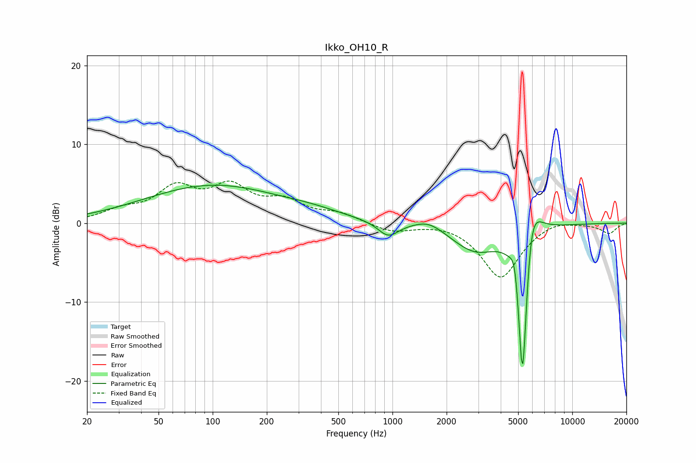

# Ikko_OH10_R
See [usage instructions](https://github.com/jaakkopasanen/AutoEq#usage) for more options and info.

### Parametric EQs
Apply preamp of -4.9 dB when using parametric equalizer.

|   # | Type    |   Fc (Hz) |    Q |   Gain (dB) |
|-----|---------|-----------|------|-------------|
|   1 | Peaking |       100 | 0.37 |         4.7 |
|   2 | Peaking |       362 | 0.86 |         0.6 |
|   3 | Peaking |       947 | 2.46 |        -1.9 |
|   4 | Peaking |      1595 | 1.71 |         1.2 |
|   5 | Peaking |      2887 | 1.04 |        -3.5 |
|   6 | Peaking |      4801 | 6    |         3.2 |
|   7 | Peaking |      5287 | 4.82 |       -18.1 |
|   8 | Peaking |      5300 | 6    |        -4.9 |
|   9 | Peaking |      5884 | 4.64 |         1.9 |
|  10 | Peaking |      5931 | 2.43 |         5.4 |

### Fixed Band EQs
When using fixed band (also called graphic) equalizer, apply preamp of **-5.4 dB** (if available) and set gains manually with these parameters.

|   # | Type    |   Fc (Hz) |    Q |   Gain (dB) |
|-----|---------|-----------|------|-------------|
|   1 | Peaking |        31 | 1.41 |         1.3 |
|   2 | Peaking |        62 | 1.41 |         4   |
|   3 | Peaking |       125 | 1.41 |         4.1 |
|   4 | Peaking |       250 | 1.41 |         2.4 |
|   5 | Peaking |       500 | 1.41 |         1.1 |
|   6 | Peaking |      1000 | 1.41 |        -1.1 |
|   7 | Peaking |      2000 | 1.41 |         0.2 |
|   8 | Peaking |      4000 | 1.41 |        -6.9 |
|   9 | Peaking |      8000 | 1.41 |         0.6 |
|  10 | Peaking |     16000 | 1.41 |        -1.3 |

### Graphs

