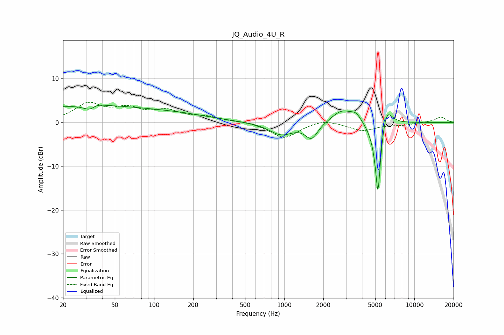

# JQ_Audio_4U_R
See [usage instructions](https://github.com/jaakkopasanen/AutoEq#usage) for more options and info.

### Parametric EQs
Apply preamp of -4.0 dB when using parametric equalizer.

|   # | Type    |   Fc (Hz) |    Q |   Gain (dB) |
|-----|---------|-----------|------|-------------|
|   1 | Peaking |        30 | 0.27 |         3.8 |
|   2 | Peaking |        33 | 2.82 |        -3.6 |
|   3 | Peaking |        34 | 2.7  |         3   |
|   4 | Peaking |       167 | 0.58 |         1.1 |
|   5 | Peaking |       949 | 1.51 |        -2.8 |
|   6 | Peaking |      1624 | 2.91 |        -3.5 |
|   7 | Peaking |      2785 | 1.74 |         3   |
|   8 | Peaking |      3572 | 3.54 |         1.7 |
|   9 | Peaking |      5248 | 5.65 |       -19.1 |
|  10 | Peaking |      6051 | 3.17 |         6.1 |

### Fixed Band EQs
When using fixed band (also called graphic) equalizer, apply preamp of **-4.7 dB** (if available) and set gains manually with these parameters.

|   # | Type    |   Fc (Hz) |    Q |   Gain (dB) |
|-----|---------|-----------|------|-------------|
|   1 | Peaking |        31 | 1.41 |         4   |
|   2 | Peaking |        62 | 1.41 |         2.7 |
|   3 | Peaking |       125 | 1.41 |         2.3 |
|   4 | Peaking |       250 | 1.41 |         1.1 |
|   5 | Peaking |       500 | 1.41 |         0.2 |
|   6 | Peaking |      1000 | 1.41 |        -3.6 |
|   7 | Peaking |      2000 | 1.41 |         0.9 |
|   8 | Peaking |      4000 | 1.41 |        -1.8 |
|   9 | Peaking |      8000 | 1.41 |        -0.5 |
|  10 | Peaking |     16000 | 1.41 |         1.2 |

### Graphs

