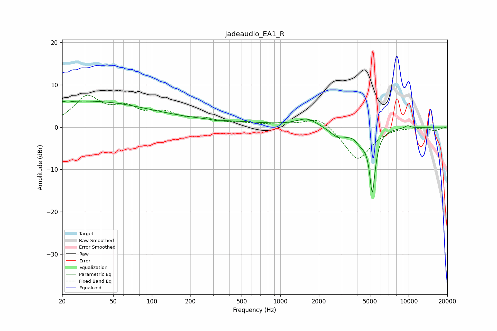

# Jadeaudio_EA1_R
See [usage instructions](https://github.com/jaakkopasanen/AutoEq#usage) for more options and info.

### Parametric EQs
Apply preamp of -6.2 dB when using parametric equalizer.

|   # | Type    |   Fc (Hz) |    Q |   Gain (dB) |
|-----|---------|-----------|------|-------------|
|   1 | Peaking |        22 | 5.72 |         2.8 |
|   2 | Peaking |        22 | 5.93 |        -2.9 |
|   3 | Peaking |        23 | 0.24 |         5.6 |
|   4 | Peaking |       167 | 0.19 |         1.4 |
|   5 | Peaking |       324 | 4.86 |        -0.3 |
|   6 | Peaking |      1621 | 1.8  |         1.9 |
|   7 | Peaking |      2858 | 2.13 |        -2.4 |
|   8 | Peaking |      4230 | 3.37 |        -2.2 |
|   9 | Peaking |      5215 | 6    |       -14.7 |
|  10 | Peaking |      9823 | 6    |         0.6 |

### Fixed Band EQs
When using fixed band (also called graphic) equalizer, apply preamp of **-7.6 dB** (if available) and set gains manually with these parameters.

|   # | Type    |   Fc (Hz) |    Q |   Gain (dB) |
|-----|---------|-----------|------|-------------|
|   1 | Peaking |        31 | 1.41 |         6.7 |
|   2 | Peaking |        62 | 1.41 |         3.7 |
|   3 | Peaking |       125 | 1.41 |         2.7 |
|   4 | Peaking |       250 | 1.41 |         1.5 |
|   5 | Peaking |       500 | 1.41 |         0.7 |
|   6 | Peaking |      1000 | 1.41 |         0.6 |
|   7 | Peaking |      2000 | 1.41 |         2.7 |
|   8 | Peaking |      4000 | 1.41 |        -7.9 |
|   9 | Peaking |      8000 | 1.41 |         0.3 |
|  10 | Peaking |     16000 | 1.41 |        -0.8 |

### Graphs

