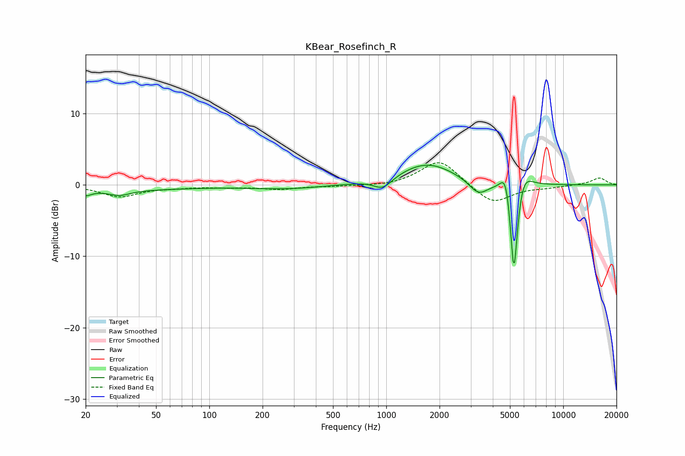

# KBear_Rosefinch_R
See [usage instructions](https://github.com/jaakkopasanen/AutoEq#usage) for more options and info.

### Parametric EQs
Apply preamp of -2.9 dB when using parametric equalizer.

|   # | Type    |   Fc (Hz) |    Q |   Gain (dB) |
|-----|---------|-----------|------|-------------|
|   1 | Peaking |        20 | 4.71 |        -0.7 |
|   2 | Peaking |        23 | 0.28 |        -0.7 |
|   3 | Peaking |        31 | 2.37 |        -0.7 |
|   4 | Peaking |       275 | 0.66 |        -0.5 |
|   5 | Peaking |       957 | 2.69 |        -1.6 |
|   6 | Peaking |      1698 | 0.88 |         3.1 |
|   7 | Peaking |      3315 | 2.65 |        -2   |
|   8 | Peaking |      4741 | 4.8  |         4   |
|   9 | Peaking |      5264 | 6    |       -15.5 |
|  10 | Peaking |      5875 | 3.02 |         3.5 |

### Fixed Band EQs
When using fixed band (also called graphic) equalizer, apply preamp of **-3.2 dB** (if available) and set gains manually with these parameters.

|   # | Type    |   Fc (Hz) |    Q |   Gain (dB) |
|-----|---------|-----------|------|-------------|
|   1 | Peaking |        31 | 1.41 |        -1.6 |
|   2 | Peaking |        62 | 1.41 |        -0.3 |
|   3 | Peaking |       125 | 1.41 |        -0.3 |
|   4 | Peaking |       250 | 1.41 |        -0.6 |
|   5 | Peaking |       500 | 1.41 |        -0.2 |
|   6 | Peaking |      1000 | 1.41 |        -0.2 |
|   7 | Peaking |      2000 | 1.41 |         3.6 |
|   8 | Peaking |      4000 | 1.41 |        -2.7 |
|   9 | Peaking |      8000 | 1.41 |        -0.3 |
|  10 | Peaking |     16000 | 1.41 |         1   |

### Graphs

