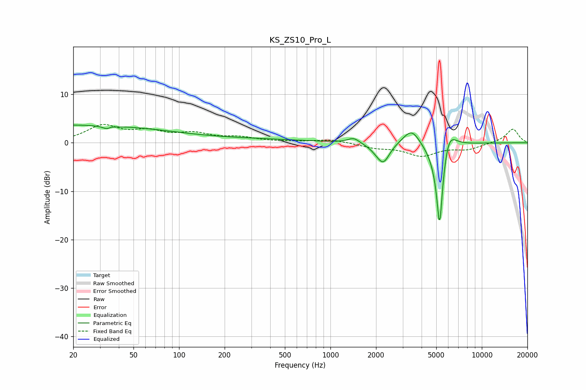

# KS_ZS10_Pro_L
See [usage instructions](https://github.com/jaakkopasanen/AutoEq#usage) for more options and info.

### Parametric EQs
Apply preamp of -3.7 dB when using parametric equalizer.

|   # | Type    |   Fc (Hz) |    Q |   Gain (dB) |
|-----|---------|-----------|------|-------------|
|   1 | Peaking |        20 | 0.2  |         3.7 |
|   2 | Peaking |        34 | 4.91 |        -3.8 |
|   3 | Peaking |        35 | 5.16 |         3.3 |
|   4 | Peaking |       312 | 0.41 |         0.6 |
|   5 | Peaking |      1424 | 3.71 |         1.1 |
|   6 | Peaking |      2035 | 2.81 |        -0.9 |
|   7 | Peaking |      2242 | 3.45 |        -3.7 |
|   8 | Peaking |      3434 | 2.56 |         3.4 |
|   9 | Peaking |      5263 | 5.5  |       -20   |
|  10 | Peaking |      5999 | 2.95 |         5.5 |

### Fixed Band EQs
When using fixed band (also called graphic) equalizer, apply preamp of **-3.9 dB** (if available) and set gains manually with these parameters.

|   # | Type    |   Fc (Hz) |    Q |   Gain (dB) |
|-----|---------|-----------|------|-------------|
|   1 | Peaking |        31 | 1.41 |         3.3 |
|   2 | Peaking |        62 | 1.41 |         2   |
|   3 | Peaking |       125 | 1.41 |         1.6 |
|   4 | Peaking |       250 | 1.41 |         1   |
|   5 | Peaking |       500 | 1.41 |         0.1 |
|   6 | Peaking |      1000 | 1.41 |         0.7 |
|   7 | Peaking |      2000 | 1.41 |        -0.9 |
|   8 | Peaking |      4000 | 1.41 |        -2.5 |
|   9 | Peaking |      8000 | 1.41 |        -1.2 |
|  10 | Peaking |     16000 | 1.41 |         2.9 |

### Graphs

