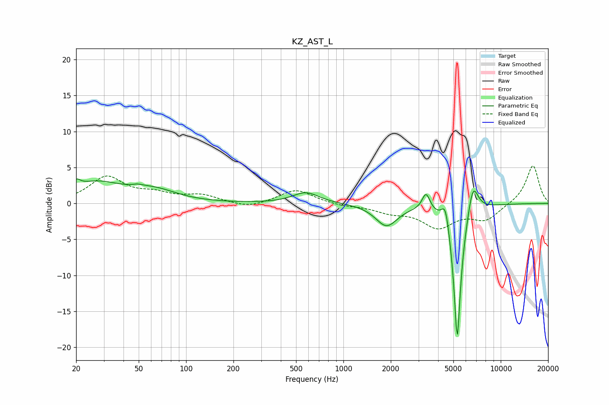

# KZ_AST_L
See [usage instructions](https://github.com/jaakkopasanen/AutoEq#usage) for more options and info.

### Parametric EQs
Apply preamp of -3.5 dB when using parametric equalizer.

|   # | Type    |   Fc (Hz) |    Q |   Gain (dB) |
|-----|---------|-----------|------|-------------|
|   1 | Peaking |        20 | 5.52 |         1.1 |
|   2 | Peaking |        27 | 0.89 |         2.7 |
|   3 | Peaking |        49 | 4.76 |         0.2 |
|   4 | Peaking |        62 | 0.98 |         1.6 |
|   5 | Peaking |       577 | 1.71 |         1.5 |
|   6 | Peaking |      1879 | 2.03 |        -3.1 |
|   7 | Peaking |      3350 | 5.72 |         2.4 |
|   8 | Peaking |      4454 | 5.67 |         3.4 |
|   9 | Peaking |      5291 | 5.66 |       -20   |
|  10 | Peaking |      6647 | 4.01 |         4.7 |

### Fixed Band EQs
When using fixed band (also called graphic) equalizer, apply preamp of **-5.3 dB** (if available) and set gains manually with these parameters.

|   # | Type    |   Fc (Hz) |    Q |   Gain (dB) |
|-----|---------|-----------|------|-------------|
|   1 | Peaking |        31 | 1.41 |         3.6 |
|   2 | Peaking |        62 | 1.41 |         1.1 |
|   3 | Peaking |       125 | 1.41 |         1   |
|   4 | Peaking |       250 | 1.41 |        -0.7 |
|   5 | Peaking |       500 | 1.41 |         2   |
|   6 | Peaking |      1000 | 1.41 |        -0.3 |
|   7 | Peaking |      2000 | 1.41 |        -1   |
|   8 | Peaking |      4000 | 1.41 |        -3.1 |
|   9 | Peaking |      8000 | 1.41 |        -2.2 |
|  10 | Peaking |     16000 | 1.41 |         5.4 |

### Graphs

