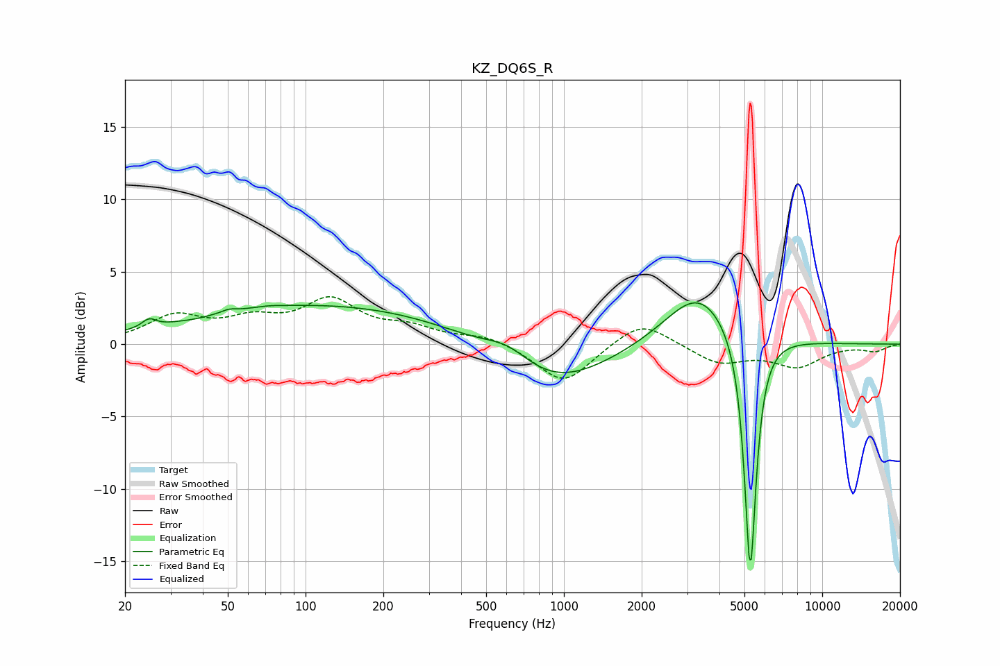

# KZ_DQ6S_R
See [usage instructions](https://github.com/jaakkopasanen/AutoEq#usage) for more options and info.

### Parametric EQs
Apply preamp of -2.9 dB when using parametric equalizer.

|   # | Type    |   Fc (Hz) |    Q |   Gain (dB) |
|-----|---------|-----------|------|-------------|
|   1 | Peaking |        25 | 5.39 |         0.6 |
|   2 | Peaking |        38 | 2.44 |        -0.1 |
|   3 | Peaking |        51 | 5.2  |         0.2 |
|   4 | Peaking |        72 | 2.66 |         0.1 |
|   5 | Peaking |       119 | 0.25 |         2.8 |
|   6 | Peaking |       610 | 1.49 |         1.3 |
|   7 | Peaking |       874 | 0.64 |        -3.3 |
|   8 | Peaking |      3328 | 1.07 |         3.9 |
|   9 | Peaking |      5259 | 6    |        -2.5 |
|  10 | Peaking |      5267 | 6    |       -14.4 |

### Fixed Band EQs
When using fixed band (also called graphic) equalizer, apply preamp of **-3.4 dB** (if available) and set gains manually with these parameters.

|   # | Type    |   Fc (Hz) |    Q |   Gain (dB) |
|-----|---------|-----------|------|-------------|
|   1 | Peaking |        31 | 1.41 |         1.8 |
|   2 | Peaking |        62 | 1.41 |         1.4 |
|   3 | Peaking |       125 | 1.41 |         2.8 |
|   4 | Peaking |       250 | 1.41 |         0.9 |
|   5 | Peaking |       500 | 1.41 |         0.6 |
|   6 | Peaking |      1000 | 1.41 |        -2.8 |
|   7 | Peaking |      2000 | 1.41 |         1.8 |
|   8 | Peaking |      4000 | 1.41 |        -1.3 |
|   9 | Peaking |      8000 | 1.41 |        -1.5 |
|  10 | Peaking |     16000 | 1.41 |        -0.4 |

### Graphs

