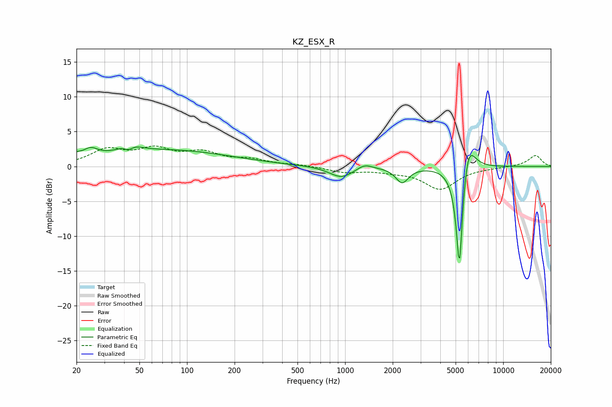

# KZ_ESX_R
See [usage instructions](https://github.com/jaakkopasanen/AutoEq#usage) for more options and info.

### Parametric EQs
Apply preamp of -2.9 dB when using parametric equalizer.

|   # | Type    |   Fc (Hz) |    Q |   Gain (dB) |
|-----|---------|-----------|------|-------------|
|   1 | Peaking |        20 | 5.48 |         0.6 |
|   2 | Peaking |        24 | 3.08 |         1.3 |
|   3 | Peaking |        43 | 4.2  |        -1.8 |
|   4 | Peaking |        43 | 2.82 |         2.2 |
|   5 | Peaking |        74 | 0.35 |         2.3 |
|   6 | Peaking |       947 | 1.88 |        -1.6 |
|   7 | Peaking |      1327 | 3.04 |         0.7 |
|   8 | Peaking |      2294 | 3.55 |        -2.2 |
|   9 | Peaking |      5287 | 6    |       -17   |
|  10 | Peaking |      5949 | 3.12 |         5.9 |

### Fixed Band EQs
When using fixed band (also called graphic) equalizer, apply preamp of **-3.0 dB** (if available) and set gains manually with these parameters.

|   # | Type    |   Fc (Hz) |    Q |   Gain (dB) |
|-----|---------|-----------|------|-------------|
|   1 | Peaking |        31 | 1.41 |         2.2 |
|   2 | Peaking |        62 | 1.41 |         2.2 |
|   3 | Peaking |       125 | 1.41 |         1.7 |
|   4 | Peaking |       250 | 1.41 |         0.8 |
|   5 | Peaking |       500 | 1.41 |         0.2 |
|   6 | Peaking |      1000 | 1.41 |        -0.8 |
|   7 | Peaking |      2000 | 1.41 |        -0.5 |
|   8 | Peaking |      4000 | 1.41 |        -3.2 |
|   9 | Peaking |      8000 | 1.41 |        -0.1 |
|  10 | Peaking |     16000 | 1.41 |         1.6 |

### Graphs

