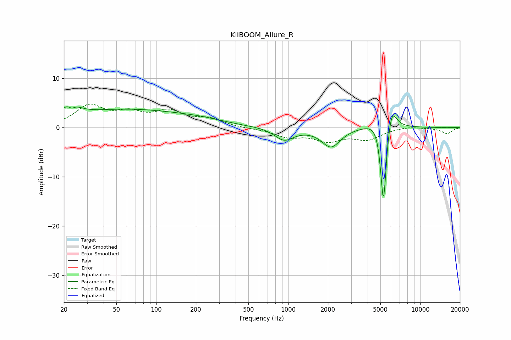

# KiiBOOM_Allure_R
See [usage instructions](https://github.com/jaakkopasanen/AutoEq#usage) for more options and info.

### Parametric EQs
Apply preamp of -4.3 dB when using parametric equalizer.

|   # | Type    |   Fc (Hz) |    Q |   Gain (dB) |
|-----|---------|-----------|------|-------------|
|   1 | Peaking |        22 | 2.66 |         3.7 |
|   2 | Peaking |        23 | 4.68 |        -2.1 |
|   3 | Peaking |        61 | 0.3  |         3.6 |
|   4 | Peaking |       225 | 0.85 |         0.5 |
|   5 | Peaking |       933 | 1.98 |        -2.5 |
|   6 | Peaking |      2112 | 1.98 |        -3.9 |
|   7 | Peaking |      5018 | 1.83 |         2.8 |
|   8 | Peaking |      5245 | 6    |        -5   |
|   9 | Peaking |      5283 | 6    |       -13.6 |
|  10 | Peaking |      6075 | 3.97 |         4.7 |

### Fixed Band EQs
When using fixed band (also called graphic) equalizer, apply preamp of **-4.9 dB** (if available) and set gains manually with these parameters.

|   # | Type    |   Fc (Hz) |    Q |   Gain (dB) |
|-----|---------|-----------|------|-------------|
|   1 | Peaking |        31 | 1.41 |         4.2 |
|   2 | Peaking |        62 | 1.41 |         2.5 |
|   3 | Peaking |       125 | 1.41 |         2.9 |
|   4 | Peaking |       250 | 1.41 |         1.6 |
|   5 | Peaking |       500 | 1.41 |        -0.1 |
|   6 | Peaking |      1000 | 1.41 |        -1.7 |
|   7 | Peaking |      2000 | 1.41 |        -2.4 |
|   8 | Peaking |      4000 | 1.41 |        -2.2 |
|   9 | Peaking |      8000 | 1.41 |         0.4 |
|  10 | Peaking |     16000 | 1.41 |        -1.2 |

### Graphs

