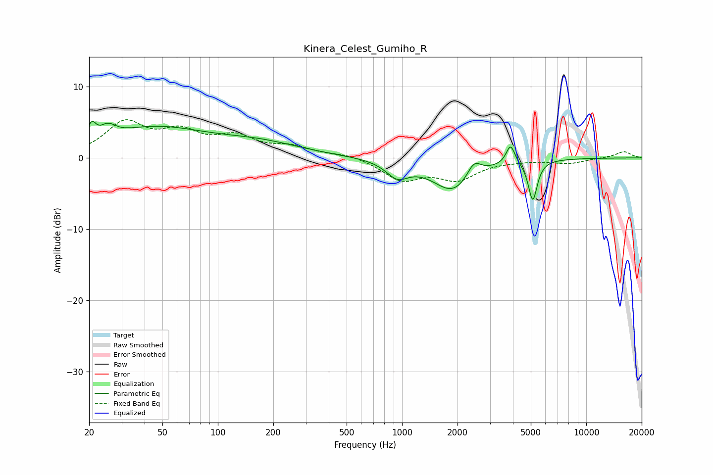

# Kinera_Celest_Gumiho_R
See [usage instructions](https://github.com/jaakkopasanen/AutoEq#usage) for more options and info.

### Parametric EQs
Apply preamp of -5.2 dB when using parametric equalizer.

|   # | Type    |   Fc (Hz) |    Q |   Gain (dB) |
|-----|---------|-----------|------|-------------|
|   1 | Peaking |        21 | 6    |         2.2 |
|   2 | Peaking |        25 | 4.77 |         4   |
|   3 | Peaking |        26 | 5.65 |        -2.5 |
|   4 | Peaking |        44 | 0.5  |         4   |
|   5 | Peaking |       168 | 0.6  |         1.7 |
|   6 | Peaking |       942 | 2.34 |        -2.2 |
|   7 | Peaking |      1897 | 1.27 |        -4.6 |
|   8 | Peaking |      2456 | 3.62 |         2.3 |
|   9 | Peaking |      3881 | 6    |         2.7 |
|  10 | Peaking |      5125 | 5.87 |        -5.6 |

### Fixed Band EQs
When using fixed band (also called graphic) equalizer, apply preamp of **-5.4 dB** (if available) and set gains manually with these parameters.

|   # | Type    |   Fc (Hz) |    Q |   Gain (dB) |
|-----|---------|-----------|------|-------------|
|   1 | Peaking |        31 | 1.41 |         4.7 |
|   2 | Peaking |        62 | 1.41 |         3.1 |
|   3 | Peaking |       125 | 1.41 |         2.6 |
|   4 | Peaking |       250 | 1.41 |         1.3 |
|   5 | Peaking |       500 | 1.41 |         0.5 |
|   6 | Peaking |      1000 | 1.41 |        -2.9 |
|   7 | Peaking |      2000 | 1.41 |        -2.7 |
|   8 | Peaking |      4000 | 1.41 |        -0.2 |
|   9 | Peaking |      8000 | 1.41 |        -0.7 |
|  10 | Peaking |     16000 | 1.41 |         0.9 |

### Graphs

