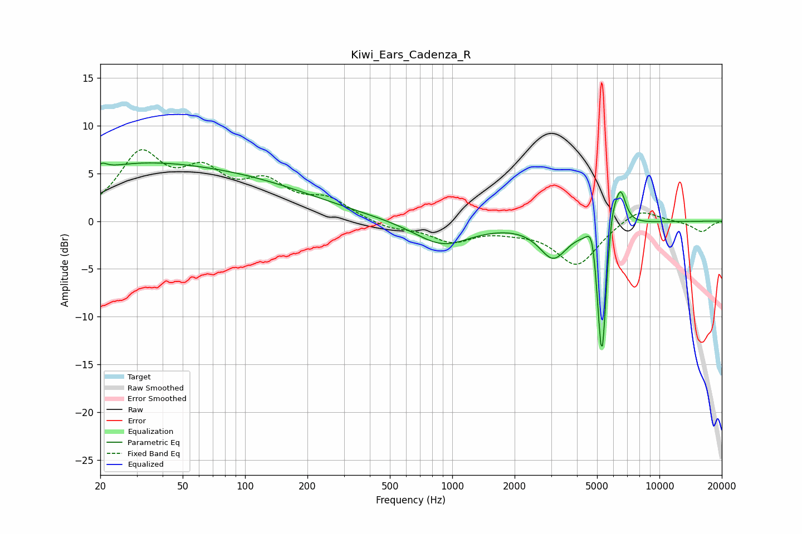

# Kiwi_Ears_Cadenza_R
See [usage instructions](https://github.com/jaakkopasanen/AutoEq#usage) for more options and info.

### Parametric EQs
Apply preamp of -6.2 dB when using parametric equalizer.

|   # | Type    |   Fc (Hz) |    Q |   Gain (dB) |
|-----|---------|-----------|------|-------------|
|   1 | Peaking |        20 | 5.77 |         0.7 |
|   2 | Peaking |        21 | 0.49 |         1.7 |
|   3 | Peaking |        55 | 0.25 |         5   |
|   4 | Peaking |       897 | 1.04 |        -2.6 |
|   5 | Peaking |      3074 | 2.07 |        -3.5 |
|   6 | Peaking |      4742 | 5.79 |         3.1 |
|   7 | Peaking |      5259 | 6    |        -3.9 |
|   8 | Peaking |      5284 | 6    |       -12.6 |
|   9 | Peaking |      5864 | 4.54 |         4.2 |
|  10 | Peaking |      6504 | 5.33 |         3.4 |

### Fixed Band EQs
When using fixed band (also called graphic) equalizer, apply preamp of **-7.6 dB** (if available) and set gains manually with these parameters.

|   # | Type    |   Fc (Hz) |    Q |   Gain (dB) |
|-----|---------|-----------|------|-------------|
|   1 | Peaking |        31 | 1.41 |         6.5 |
|   2 | Peaking |        62 | 1.41 |         4.2 |
|   3 | Peaking |       125 | 1.41 |         3.4 |
|   4 | Peaking |       250 | 1.41 |         2   |
|   5 | Peaking |       500 | 1.41 |        -0.8 |
|   6 | Peaking |      1000 | 1.41 |        -2   |
|   7 | Peaking |      2000 | 1.41 |        -0.6 |
|   8 | Peaking |      4000 | 1.41 |        -4.6 |
|   9 | Peaking |      8000 | 1.41 |         1.6 |
|  10 | Peaking |     16000 | 1.41 |        -1.1 |

### Graphs

