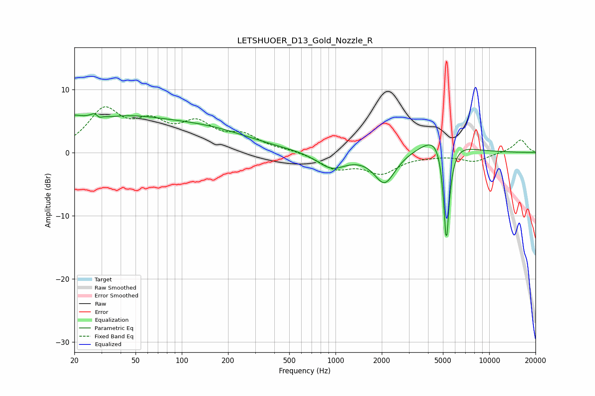

# LETSHUOER_D13_Gold_Nozzle_R
See [usage instructions](https://github.com/jaakkopasanen/AutoEq#usage) for more options and info.

### Parametric EQs
Apply preamp of -6.2 dB when using parametric equalizer.

|   # | Type    |   Fc (Hz) |    Q |   Gain (dB) |
|-----|---------|-----------|------|-------------|
|   1 | Peaking |        21 | 0.26 |         6.2 |
|   2 | Peaking |        28 | 1.54 |        -1.7 |
|   3 | Peaking |        28 | 4.59 |         3.9 |
|   4 | Peaking |        29 | 5.78 |        -3.2 |
|   5 | Peaking |        93 | 0.34 |         0.5 |
|   6 | Peaking |       159 | 0.5  |         2.3 |
|   7 | Peaking |       944 | 1.49 |        -2.5 |
|   8 | Peaking |      2088 | 2.06 |        -4.9 |
|   9 | Peaking |      4970 | 1.57 |         6.5 |
|  10 | Peaking |      5261 | 6    |       -19.7 |

### Fixed Band EQs
When using fixed band (also called graphic) equalizer, apply preamp of **-7.3 dB** (if available) and set gains manually with these parameters.

|   # | Type    |   Fc (Hz) |    Q |   Gain (dB) |
|-----|---------|-----------|------|-------------|
|   1 | Peaking |        31 | 1.41 |         6.4 |
|   2 | Peaking |        62 | 1.41 |         3.8 |
|   3 | Peaking |       125 | 1.41 |         4   |
|   4 | Peaking |       250 | 1.41 |         2.4 |
|   5 | Peaking |       500 | 1.41 |         0.3 |
|   6 | Peaking |      1000 | 1.41 |        -2.4 |
|   7 | Peaking |      2000 | 1.41 |        -3   |
|   8 | Peaking |      4000 | 1.41 |        -0.3 |
|   9 | Peaking |      8000 | 1.41 |        -1.4 |
|  10 | Peaking |     16000 | 1.41 |         2.1 |

### Graphs

