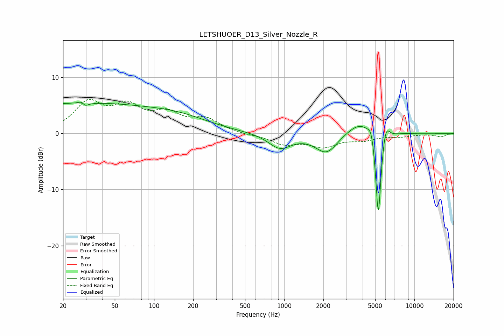

# LETSHUOER_D13_Silver_Nozzle_R
See [usage instructions](https://github.com/jaakkopasanen/AutoEq#usage) for more options and info.

### Parametric EQs
Apply preamp of -5.7 dB when using parametric equalizer.

|   # | Type    |   Fc (Hz) |    Q |   Gain (dB) |
|-----|---------|-----------|------|-------------|
|   1 | Peaking |        26 | 0.2  |         5.3 |
|   2 | Peaking |        28 | 5.69 |         3.1 |
|   3 | Peaking |        29 | 5.57 |        -3.3 |
|   4 | Peaking |       163 | 0.6  |         1.6 |
|   5 | Peaking |       927 | 1.6  |        -2.6 |
|   6 | Peaking |      2119 | 1.62 |        -3.6 |
|   7 | Peaking |      3992 | 1.27 |         3   |
|   8 | Peaking |      4693 | 5.47 |         2.9 |
|   9 | Peaking |      5283 | 5.9  |       -17.9 |
|  10 | Peaking |      6002 | 4.82 |         3.9 |

### Fixed Band EQs
When using fixed band (also called graphic) equalizer, apply preamp of **-6.2 dB** (if available) and set gains manually with these parameters.

|   # | Type    |   Fc (Hz) |    Q |   Gain (dB) |
|-----|---------|-----------|------|-------------|
|   1 | Peaking |        31 | 1.41 |         5.1 |
|   2 | Peaking |        62 | 1.41 |         4.2 |
|   3 | Peaking |       125 | 1.41 |         3   |
|   4 | Peaking |       250 | 1.41 |         2.3 |
|   5 | Peaking |       500 | 1.41 |        -0.2 |
|   6 | Peaking |      1000 | 1.41 |        -1.8 |
|   7 | Peaking |      2000 | 1.41 |        -2.1 |
|   8 | Peaking |      4000 | 1.41 |        -1   |
|   9 | Peaking |      8000 | 1.41 |        -0.4 |
|  10 | Peaking |     16000 | 1.41 |        -0.6 |

### Graphs

