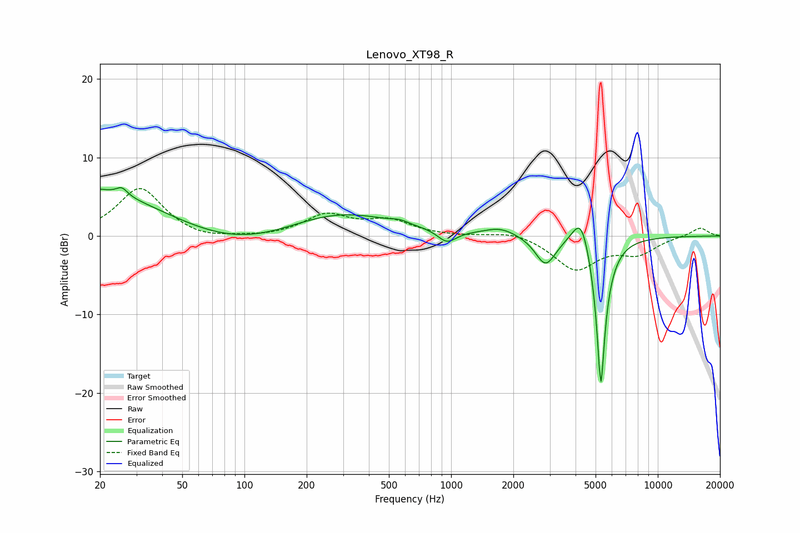

# Lenovo_XT98_R
See [usage instructions](https://github.com/jaakkopasanen/AutoEq#usage) for more options and info.

### Parametric EQs
Apply preamp of -6.2 dB when using parametric equalizer.

|   # | Type    |   Fc (Hz) |    Q |   Gain (dB) |
|-----|---------|-----------|------|-------------|
|   1 | Peaking |        20 | 0.25 |         7.5 |
|   2 | Peaking |        26 | 5.36 |         1   |
|   3 | Peaking |        76 | 0.38 |        -4.7 |
|   4 | Peaking |       266 | 0.51 |         3.8 |
|   5 | Peaking |       566 | 3.74 |         0.4 |
|   6 | Peaking |       954 | 3.12 |        -1.6 |
|   7 | Peaking |      1737 | 1.84 |         1   |
|   8 | Peaking |      2864 | 2.89 |        -3.7 |
|   9 | Peaking |      4266 | 3.23 |         4.6 |
|  10 | Peaking |      5303 | 6    |       -20   |

### Fixed Band EQs
When using fixed band (also called graphic) equalizer, apply preamp of **-6.1 dB** (if available) and set gains manually with these parameters.

|   # | Type    |   Fc (Hz) |    Q |   Gain (dB) |
|-----|---------|-----------|------|-------------|
|   1 | Peaking |        31 | 1.41 |         6.1 |
|   2 | Peaking |        62 | 1.41 |        -0.6 |
|   3 | Peaking |       125 | 1.41 |        -0.2 |
|   4 | Peaking |       250 | 1.41 |         2.6 |
|   5 | Peaking |       500 | 1.41 |         1.8 |
|   6 | Peaking |      1000 | 1.41 |        -0   |
|   7 | Peaking |      2000 | 1.41 |         0.7 |
|   8 | Peaking |      4000 | 1.41 |        -4.2 |
|   9 | Peaking |      8000 | 1.41 |        -2   |
|  10 | Peaking |     16000 | 1.41 |         1.1 |

### Graphs

