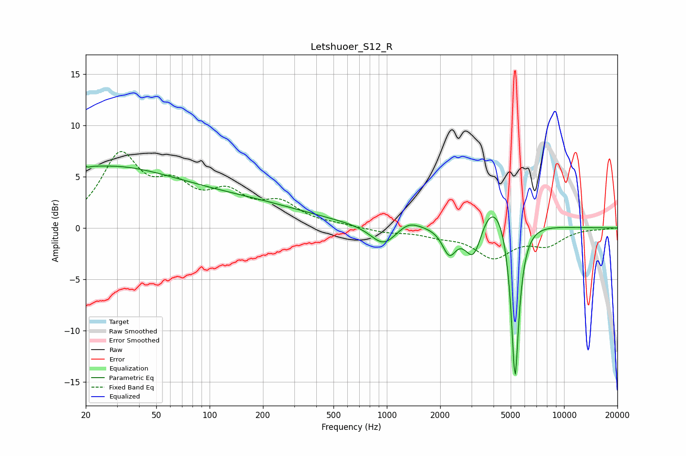

# Letshuoer_S12_R
See [usage instructions](https://github.com/jaakkopasanen/AutoEq#usage) for more options and info.

### Parametric EQs
Apply preamp of -6.1 dB when using parametric equalizer.

|   # | Type    |   Fc (Hz) |    Q |   Gain (dB) |
|-----|---------|-----------|------|-------------|
|   1 | Peaking |        20 | 5.12 |         3.6 |
|   2 | Peaking |        20 | 5.55 |        -3.3 |
|   3 | Peaking |        25 | 0.34 |         5.6 |
|   4 | Peaking |       156 | 0.39 |         2.1 |
|   5 | Peaking |       958 | 1.95 |        -2   |
|   6 | Peaking |      1326 | 2.26 |         0.8 |
|   7 | Peaking |      2252 | 3.58 |        -2.7 |
|   8 | Peaking |      3092 | 2.69 |        -4.6 |
|   9 | Peaking |      3972 | 1.28 |         4.4 |
|  10 | Peaking |      5291 | 6    |       -16.7 |

### Fixed Band EQs
When using fixed band (also called graphic) equalizer, apply preamp of **-7.5 dB** (if available) and set gains manually with these parameters.

|   # | Type    |   Fc (Hz) |    Q |   Gain (dB) |
|-----|---------|-----------|------|-------------|
|   1 | Peaking |        31 | 1.41 |         6.7 |
|   2 | Peaking |        62 | 1.41 |         3.2 |
|   3 | Peaking |       125 | 1.41 |         2.8 |
|   4 | Peaking |       250 | 1.41 |         2.1 |
|   5 | Peaking |       500 | 1.41 |         0.2 |
|   6 | Peaking |      1000 | 1.41 |        -0.4 |
|   7 | Peaking |      2000 | 1.41 |        -0.6 |
|   8 | Peaking |      4000 | 1.41 |        -2.7 |
|   9 | Peaking |      8000 | 1.41 |        -1.5 |
|  10 | Peaking |     16000 | 1.41 |        -0.1 |

### Graphs

