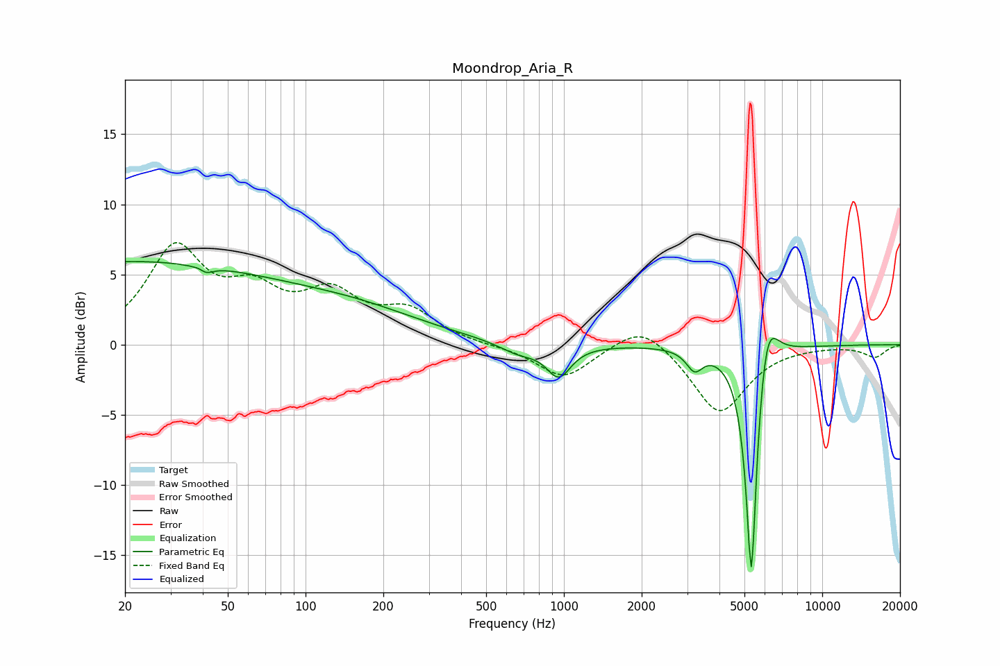

# Moondrop_Aria_R
See [usage instructions](https://github.com/jaakkopasanen/AutoEq#usage) for more options and info.

### Parametric EQs
Apply preamp of -6.0 dB when using parametric equalizer.

|   # | Type    |   Fc (Hz) |    Q |   Gain (dB) |
|-----|---------|-----------|------|-------------|
|   1 | Peaking |        20 | 0.21 |         5.8 |
|   2 | Peaking |        40 | 5.43 |         3.4 |
|   3 | Peaking |        40 | 5.28 |        -3.8 |
|   4 | Peaking |       164 | 0.54 |         1.6 |
|   5 | Peaking |       623 | 1.02 |        -0.1 |
|   6 | Peaking |       668 | 1.93 |        -0.7 |
|   7 | Peaking |       956 | 3.04 |        -2.2 |
|   8 | Peaking |      3203 | 4.54 |        -1.4 |
|   9 | Peaking |      5319 | 6    |       -18.2 |
|  10 | Peaking |      6074 | 3.37 |         4.6 |

### Fixed Band EQs
When using fixed band (also called graphic) equalizer, apply preamp of **-7.4 dB** (if available) and set gains manually with these parameters.

|   # | Type    |   Fc (Hz) |    Q |   Gain (dB) |
|-----|---------|-----------|------|-------------|
|   1 | Peaking |        31 | 1.41 |         6.6 |
|   2 | Peaking |        62 | 1.41 |         3   |
|   3 | Peaking |       125 | 1.41 |         3.2 |
|   4 | Peaking |       250 | 1.41 |         2.2 |
|   5 | Peaking |       500 | 1.41 |        -0.1 |
|   6 | Peaking |      1000 | 1.41 |        -2.4 |
|   7 | Peaking |      2000 | 1.41 |         1.8 |
|   8 | Peaking |      4000 | 1.41 |        -4.9 |
|   9 | Peaking |      8000 | 1.41 |        -0   |
|  10 | Peaking |     16000 | 1.41 |        -0.9 |

### Graphs

