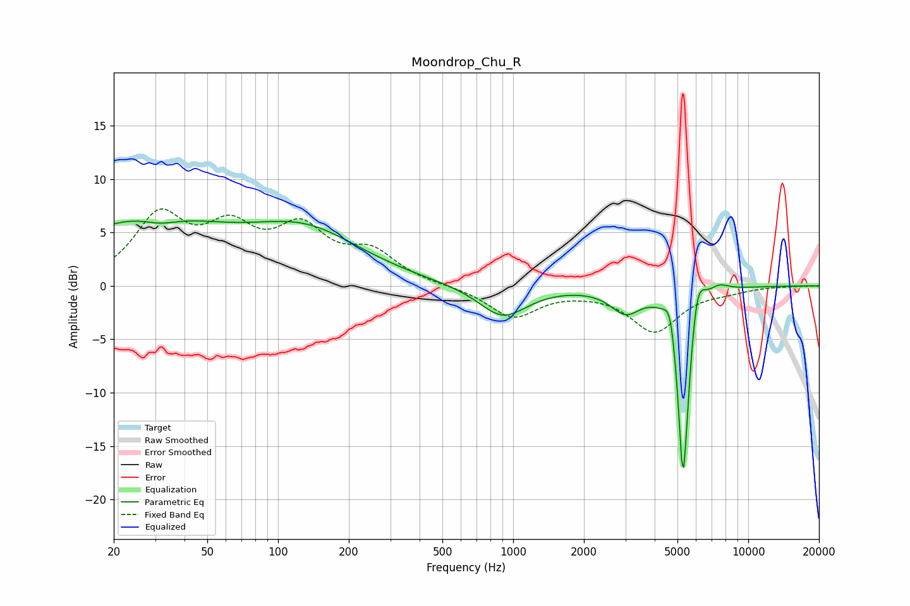

# Moondrop_Chu_R
See [usage instructions](https://github.com/jaakkopasanen/AutoEq#usage) for more options and info.

### Parametric EQs
Apply preamp of -6.2 dB when using parametric equalizer.

|   # | Type    |   Fc (Hz) |    Q |   Gain (dB) |
|-----|---------|-----------|------|-------------|
|   1 | Peaking |        27 | 0.43 |         6.1 |
|   2 | Peaking |        32 | 1.75 |        -0.9 |
|   3 | Peaking |       132 | 0.58 |         4.6 |
|   4 | Peaking |       904 | 1.38 |        -3   |
|   5 | Peaking |      3009 | 2.24 |        -2.2 |
|   6 | Peaking |      4656 | 5.89 |         2.5 |
|   7 | Peaking |      5273 | 5.99 |       -16.4 |
|   8 | Peaking |      5423 | 6    |        -2.9 |
|   9 | Peaking |      6076 | 4.75 |         3.5 |
|  10 | Peaking |      7523 | 3.29 |         0.7 |

### Fixed Band EQs
When using fixed band (also called graphic) equalizer, apply preamp of **-7.3 dB** (if available) and set gains manually with these parameters.

|   # | Type    |   Fc (Hz) |    Q |   Gain (dB) |
|-----|---------|-----------|------|-------------|
|   1 | Peaking |        31 | 1.41 |         6.1 |
|   2 | Peaking |        62 | 1.41 |         4.5 |
|   3 | Peaking |       125 | 1.41 |         4.7 |
|   4 | Peaking |       250 | 1.41 |         2.8 |
|   5 | Peaking |       500 | 1.41 |        -0   |
|   6 | Peaking |      1000 | 1.41 |        -2.9 |
|   7 | Peaking |      2000 | 1.41 |        -0.2 |
|   8 | Peaking |      4000 | 1.41 |        -4.2 |
|   9 | Peaking |      8000 | 1.41 |        -0.4 |
|  10 | Peaking |     16000 | 1.41 |         0   |

### Graphs

