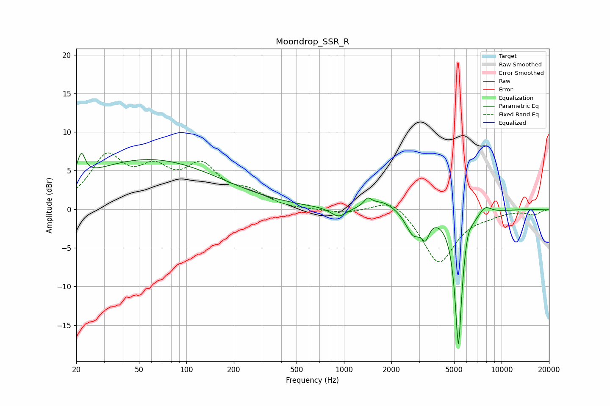

# Moondrop_SSR_R
See [usage instructions](https://github.com/jaakkopasanen/AutoEq#usage) for more options and info.

### Parametric EQs
Apply preamp of -7.4 dB when using parametric equalizer.

|   # | Type    |   Fc (Hz) |    Q |   Gain (dB) |
|-----|---------|-----------|------|-------------|
|   1 | Peaking |        22 | 5.96 |         3.1 |
|   2 | Peaking |        58 | 0.31 |         6.4 |
|   3 | Peaking |       925 | 2.86 |        -1.3 |
|   4 | Peaking |      1416 | 5.93 |         1   |
|   5 | Peaking |      1766 | 1.7  |         1.2 |
|   6 | Peaking |      2761 | 2.89 |        -3.1 |
|   7 | Peaking |      3288 | 5.95 |        -2.2 |
|   8 | Peaking |      5324 | 6    |       -17.9 |
|   9 | Peaking |      6083 | 6    |         1.3 |
|  10 | Peaking |      7857 | 3.6  |         1.1 |

### Fixed Band EQs
When using fixed band (also called graphic) equalizer, apply preamp of **-7.4 dB** (if available) and set gains manually with these parameters.

|   # | Type    |   Fc (Hz) |    Q |   Gain (dB) |
|-----|---------|-----------|------|-------------|
|   1 | Peaking |        31 | 1.41 |         6.3 |
|   2 | Peaking |        62 | 1.41 |         4   |
|   3 | Peaking |       125 | 1.41 |         4.9 |
|   4 | Peaking |       250 | 1.41 |         1.8 |
|   5 | Peaking |       500 | 1.41 |        -0.1 |
|   6 | Peaking |      1000 | 1.41 |        -0.5 |
|   7 | Peaking |      2000 | 1.41 |         1.8 |
|   8 | Peaking |      4000 | 1.41 |        -7   |
|   9 | Peaking |      8000 | 1.41 |        -0.5 |
|  10 | Peaking |     16000 | 1.41 |        -0.7 |

### Graphs

