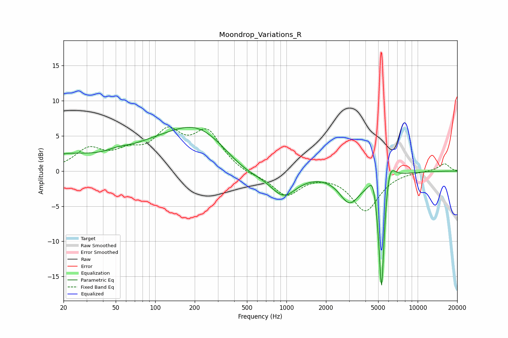

# Moondrop_Variations_R
See [usage instructions](https://github.com/jaakkopasanen/AutoEq#usage) for more options and info.

### Parametric EQs
Apply preamp of -6.3 dB when using parametric equalizer.

|   # | Type    |   Fc (Hz) |    Q |   Gain (dB) |
|-----|---------|-----------|------|-------------|
|   1 | Peaking |        20 | 0.65 |         2   |
|   2 | Peaking |        51 | 1.89 |         0.5 |
|   3 | Peaking |        88 | 0.56 |         1.9 |
|   4 | Peaking |       217 | 0.58 |         5.8 |
|   5 | Peaking |       473 | 0.82 |        -1.9 |
|   6 | Peaking |       951 | 1.41 |        -3.4 |
|   7 | Peaking |      3025 | 1.81 |        -4   |
|   8 | Peaking |      4575 | 4.53 |         3.1 |
|   9 | Peaking |      5302 | 5.79 |       -19.5 |
|  10 | Peaking |      6021 | 3.29 |         5   |

### Fixed Band EQs
When using fixed band (also called graphic) equalizer, apply preamp of **-6.4 dB** (if available) and set gains manually with these parameters.

|   # | Type    |   Fc (Hz) |    Q |   Gain (dB) |
|-----|---------|-----------|------|-------------|
|   1 | Peaking |        31 | 1.41 |         2.9 |
|   2 | Peaking |        62 | 1.41 |         2.1 |
|   3 | Peaking |       125 | 1.41 |         4.8 |
|   4 | Peaking |       250 | 1.41 |         5.2 |
|   5 | Peaking |       500 | 1.41 |        -0.5 |
|   6 | Peaking |      1000 | 1.41 |        -3.4 |
|   7 | Peaking |      2000 | 1.41 |        -0.1 |
|   8 | Peaking |      4000 | 1.41 |        -5.5 |
|   9 | Peaking |      8000 | 1.41 |         0   |
|  10 | Peaking |     16000 | 1.41 |         1.1 |

### Graphs

