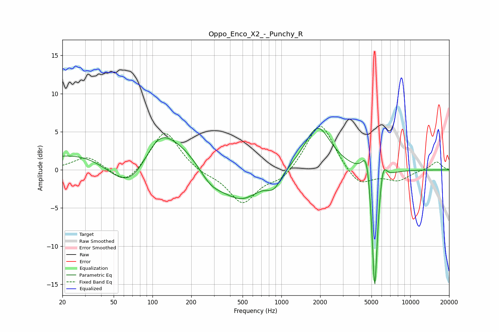

# Oppo_Enco_X2_-_Punchy_R
See [usage instructions](https://github.com/jaakkopasanen/AutoEq#usage) for more options and info.

### Parametric EQs
Apply preamp of -5.5 dB when using parametric equalizer.

|   # | Type    |   Fc (Hz) |    Q |   Gain (dB) |
|-----|---------|-----------|------|-------------|
|   1 | Peaking |        68 | 0.67 |        -8.7 |
|   2 | Peaking |        99 | 0.2  |         6.8 |
|   3 | Peaking |       111 | 1.16 |         3.8 |
|   4 | Peaking |       282 | 1.23 |        -3.5 |
|   5 | Peaking |       485 | 0.83 |        -5.9 |
|   6 | Peaking |       875 | 2.61 |        -1.8 |
|   7 | Peaking |      1913 | 1.4  |         5.8 |
|   8 | Peaking |      4601 | 4.08 |         4.7 |
|   9 | Peaking |      5296 | 5.94 |       -18.5 |
|  10 | Peaking |      6114 | 4.76 |         3.5 |

### Fixed Band EQs
When using fixed band (also called graphic) equalizer, apply preamp of **-5.8 dB** (if available) and set gains manually with these parameters.

|   # | Type    |   Fc (Hz) |    Q |   Gain (dB) |
|-----|---------|-----------|------|-------------|
|   1 | Peaking |        31 | 1.41 |         1.8 |
|   2 | Peaking |        62 | 1.41 |        -2.2 |
|   3 | Peaking |       125 | 1.41 |         5.4 |
|   4 | Peaking |       250 | 1.41 |        -0.5 |
|   5 | Peaking |       500 | 1.41 |        -4.3 |
|   6 | Peaking |      1000 | 1.41 |        -1.4 |
|   7 | Peaking |      2000 | 1.41 |         6.6 |
|   8 | Peaking |      4000 | 1.41 |        -2.4 |
|   9 | Peaking |      8000 | 1.41 |        -1.3 |
|  10 | Peaking |     16000 | 1.41 |         1.1 |

### Graphs

