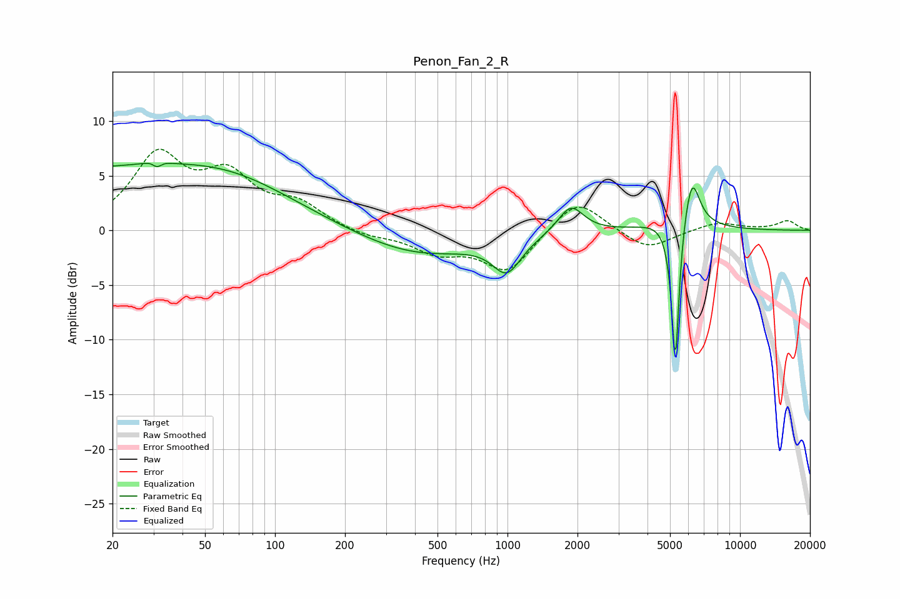

# Penon_Fan_2_R
See [usage instructions](https://github.com/jaakkopasanen/AutoEq#usage) for more options and info.

### Parametric EQs
Apply preamp of -6.2 dB when using parametric equalizer.

|   # | Type    |   Fc (Hz) |    Q |   Gain (dB) |
|-----|---------|-----------|------|-------------|
|   1 | Peaking |        21 | 0.19 |         5.6 |
|   2 | Peaking |        31 | 5.04 |         2.9 |
|   3 | Peaking |        31 | 5.75 |        -3.1 |
|   4 | Peaking |        64 | 0.6  |         1.2 |
|   5 | Peaking |       413 | 0.53 |        -2.4 |
|   6 | Peaking |       994 | 2.33 |        -3.1 |
|   7 | Peaking |      1872 | 2.58 |         2.6 |
|   8 | Peaking |      5272 | 6    |       -19.6 |
|   9 | Peaking |      5357 | 2.27 |         7.1 |
|  10 | Peaking |      6220 | 4.44 |         3.9 |

### Fixed Band EQs
When using fixed band (also called graphic) equalizer, apply preamp of **-7.5 dB** (if available) and set gains manually with these parameters.

|   # | Type    |   Fc (Hz) |    Q |   Gain (dB) |
|-----|---------|-----------|------|-------------|
|   1 | Peaking |        31 | 1.41 |         6.5 |
|   2 | Peaking |        62 | 1.41 |         4.4 |
|   3 | Peaking |       125 | 1.41 |         2.1 |
|   4 | Peaking |       250 | 1.41 |        -0.6 |
|   5 | Peaking |       500 | 1.41 |        -1.8 |
|   6 | Peaking |      1000 | 1.41 |        -3.7 |
|   7 | Peaking |      2000 | 1.41 |         3.1 |
|   8 | Peaking |      4000 | 1.41 |        -1.8 |
|   9 | Peaking |      8000 | 1.41 |         0.8 |
|  10 | Peaking |     16000 | 1.41 |         0.9 |

### Graphs

