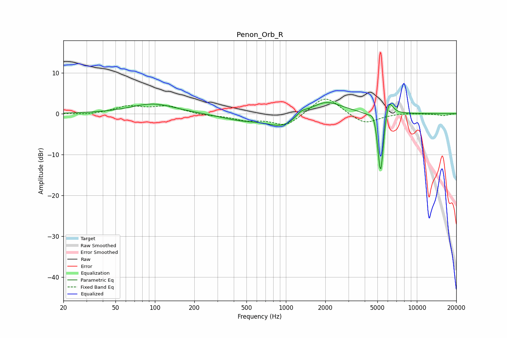

# Penon_Orb_R
See [usage instructions](https://github.com/jaakkopasanen/AutoEq#usage) for more options and info.

### Parametric EQs
Apply preamp of -2.8 dB when using parametric equalizer.

|   # | Type    |   Fc (Hz) |    Q |   Gain (dB) |
|-----|---------|-----------|------|-------------|
|   1 | Peaking |        97 | 0.84 |         2.4 |
|   2 | Peaking |       453 | 0.89 |        -1.4 |
|   3 | Peaking |       964 | 1.13 |        -3.3 |
|   4 | Peaking |      1311 | 3.43 |         1.3 |
|   5 | Peaking |      1999 | 1.13 |         3.5 |
|   6 | Peaking |      4693 | 5.87 |         2.3 |
|   7 | Peaking |      5277 | 6    |        -3.3 |
|   8 | Peaking |      5286 | 6    |       -13.5 |
|   9 | Peaking |      6070 | 5.15 |         3.7 |
|  10 | Peaking |      6091 | 2.97 |         1.8 |

### Fixed Band EQs
When using fixed band (also called graphic) equalizer, apply preamp of **-3.6 dB** (if available) and set gains manually with these parameters.

|   # | Type    |   Fc (Hz) |    Q |   Gain (dB) |
|-----|---------|-----------|------|-------------|
|   1 | Peaking |        31 | 1.41 |        -0.3 |
|   2 | Peaking |        62 | 1.41 |         1.7 |
|   3 | Peaking |       125 | 1.41 |         1.8 |
|   4 | Peaking |       250 | 1.41 |        -0.4 |
|   5 | Peaking |       500 | 1.41 |        -1.4 |
|   6 | Peaking |      1000 | 1.41 |        -3.1 |
|   7 | Peaking |      2000 | 1.41 |         4.6 |
|   8 | Peaking |      4000 | 1.41 |        -2.7 |
|   9 | Peaking |      8000 | 1.41 |         0.2 |
|  10 | Peaking |     16000 | 1.41 |        -0.5 |

### Graphs

