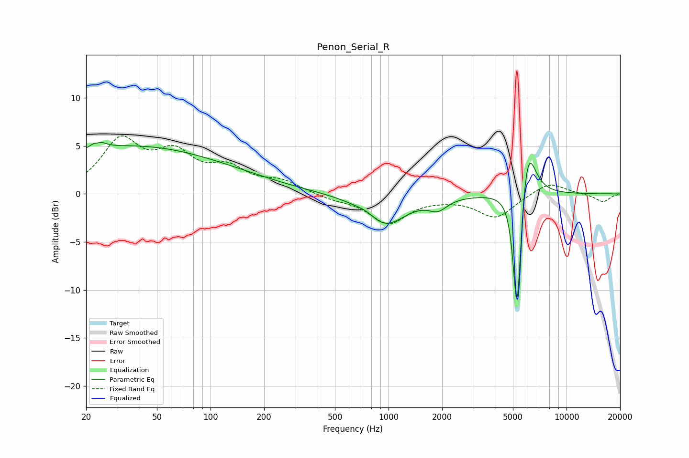

# Penon_Serial_R
See [usage instructions](https://github.com/jaakkopasanen/AutoEq#usage) for more options and info.

### Parametric EQs
Apply preamp of -5.5 dB when using parametric equalizer.

|   # | Type    |   Fc (Hz) |    Q |   Gain (dB) |
|-----|---------|-----------|------|-------------|
|   1 | Peaking |        23 | 5.17 |         3.7 |
|   2 | Peaking |        23 | 5.88 |        -3.1 |
|   3 | Peaking |        36 | 0.26 |         4.9 |
|   4 | Peaking |       181 | 0.66 |         0.2 |
|   5 | Peaking |       758 | 2.57 |         0.5 |
|   6 | Peaking |       948 | 1.21 |        -3.3 |
|   7 | Peaking |      1894 | 2.79 |        -1.1 |
|   8 | Peaking |      5272 | 6    |       -11.2 |
|   9 | Peaking |      5280 | 6    |        -2.9 |
|  10 | Peaking |      6038 | 3.17 |         6.2 |

### Fixed Band EQs
When using fixed band (also called graphic) equalizer, apply preamp of **-6.1 dB** (if available) and set gains manually with these parameters.

|   # | Type    |   Fc (Hz) |    Q |   Gain (dB) |
|-----|---------|-----------|------|-------------|
|   1 | Peaking |        31 | 1.41 |         5.3 |
|   2 | Peaking |        62 | 1.41 |         3.6 |
|   3 | Peaking |       125 | 1.41 |         2.3 |
|   4 | Peaking |       250 | 1.41 |         1.2 |
|   5 | Peaking |       500 | 1.41 |        -0.5 |
|   6 | Peaking |      1000 | 1.41 |        -3   |
|   7 | Peaking |      2000 | 1.41 |        -0.2 |
|   8 | Peaking |      4000 | 1.41 |        -2.4 |
|   9 | Peaking |      8000 | 1.41 |         1.3 |
|  10 | Peaking |     16000 | 1.41 |        -0.8 |

### Graphs

