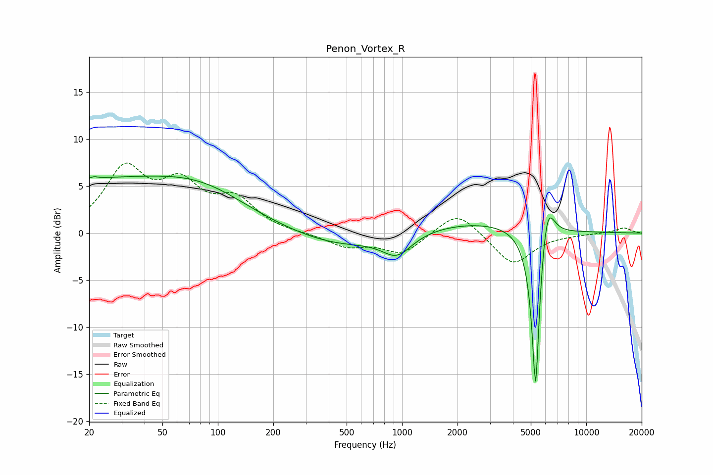

# Penon_Vortex_R
See [usage instructions](https://github.com/jaakkopasanen/AutoEq#usage) for more options and info.

### Parametric EQs
Apply preamp of -6.2 dB when using parametric equalizer.

|   # | Type    |   Fc (Hz) |    Q |   Gain (dB) |
|-----|---------|-----------|------|-------------|
|   1 | Peaking |        21 | 5.92 |        -3   |
|   2 | Peaking |        21 | 6    |         3.2 |
|   3 | Peaking |        22 | 0.2  |         5.5 |
|   4 | Peaking |        85 | 0.59 |         1.9 |
|   5 | Peaking |       457 | 0.57 |        -1.5 |
|   6 | Peaking |       939 | 1.93 |         0.7 |
|   7 | Peaking |       939 | 1.79 |        -2.9 |
|   8 | Peaking |      2514 | 0.43 |         1.3 |
|   9 | Peaking |      5312 | 6    |       -19.2 |
|  10 | Peaking |      6112 | 3.56 |         5.5 |

### Fixed Band EQs
When using fixed band (also called graphic) equalizer, apply preamp of **-7.5 dB** (if available) and set gains manually with these parameters.

|   # | Type    |   Fc (Hz) |    Q |   Gain (dB) |
|-----|---------|-----------|------|-------------|
|   1 | Peaking |        31 | 1.41 |         6.5 |
|   2 | Peaking |        62 | 1.41 |         4.5 |
|   3 | Peaking |       125 | 1.41 |         3.2 |
|   4 | Peaking |       250 | 1.41 |        -0   |
|   5 | Peaking |       500 | 1.41 |        -1.4 |
|   6 | Peaking |      1000 | 1.41 |        -2.2 |
|   7 | Peaking |      2000 | 1.41 |         2.5 |
|   8 | Peaking |      4000 | 1.41 |        -3.4 |
|   9 | Peaking |      8000 | 1.41 |        -0.1 |
|  10 | Peaking |     16000 | 1.41 |         0.6 |

### Graphs

