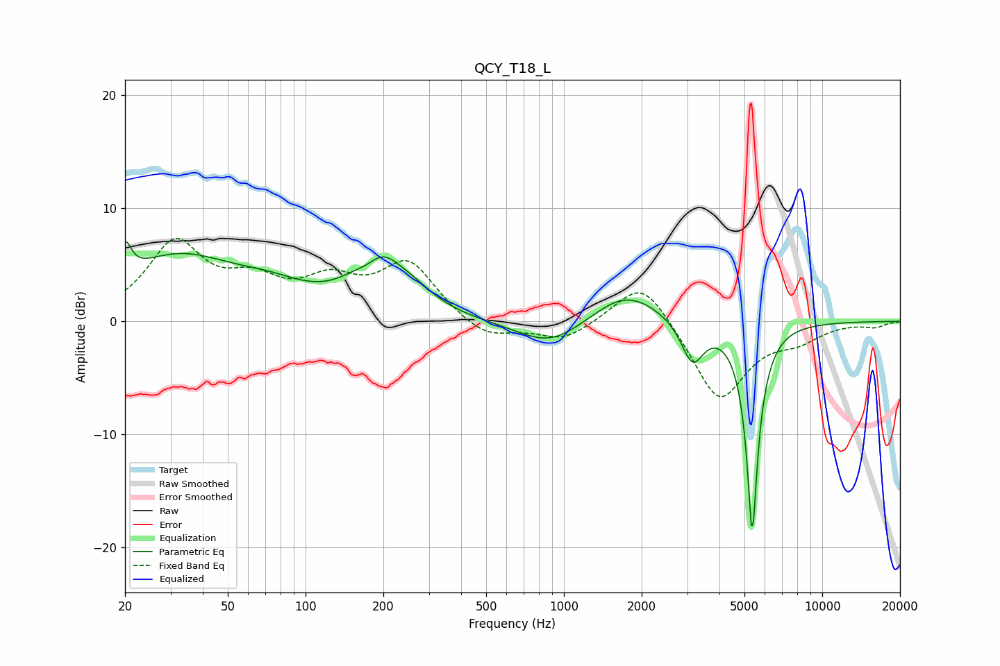

# QCY_T18_L
See [usage instructions](https://github.com/jaakkopasanen/AutoEq#usage) for more options and info.

### Parametric EQs
Apply preamp of -7.1 dB when using parametric equalizer.

|   # | Type    |   Fc (Hz) |    Q |   Gain (dB) |
|-----|---------|-----------|------|-------------|
|   1 | Peaking |        20 | 6    |         2.8 |
|   2 | Peaking |        32 | 0.62 |         5.5 |
|   3 | Peaking |        73 | 0.97 |         1.5 |
|   4 | Peaking |       177 | 2.62 |        -1.7 |
|   5 | Peaking |       188 | 1.52 |         6   |
|   6 | Peaking |       265 | 1.62 |         1.1 |
|   7 | Peaking |       885 | 1.09 |        -2.4 |
|   8 | Peaking |      1740 | 1.09 |         2.8 |
|   9 | Peaking |      3144 | 3.29 |        -3.7 |
|  10 | Peaking |      5359 | 6    |       -18.6 |

### Fixed Band EQs
When using fixed band (also called graphic) equalizer, apply preamp of **-7.4 dB** (if available) and set gains manually with these parameters.

|   # | Type    |   Fc (Hz) |    Q |   Gain (dB) |
|-----|---------|-----------|------|-------------|
|   1 | Peaking |        31 | 1.41 |         6.7 |
|   2 | Peaking |        62 | 1.41 |         2.8 |
|   3 | Peaking |       125 | 1.41 |         3   |
|   4 | Peaking |       250 | 1.41 |         5   |
|   5 | Peaking |       500 | 1.41 |        -1.7 |
|   6 | Peaking |      1000 | 1.41 |        -1.7 |
|   7 | Peaking |      2000 | 1.41 |         4.1 |
|   8 | Peaking |      4000 | 1.41 |        -7.1 |
|   9 | Peaking |      8000 | 1.41 |        -1.3 |
|  10 | Peaking |     16000 | 1.41 |        -0.4 |

### Graphs

