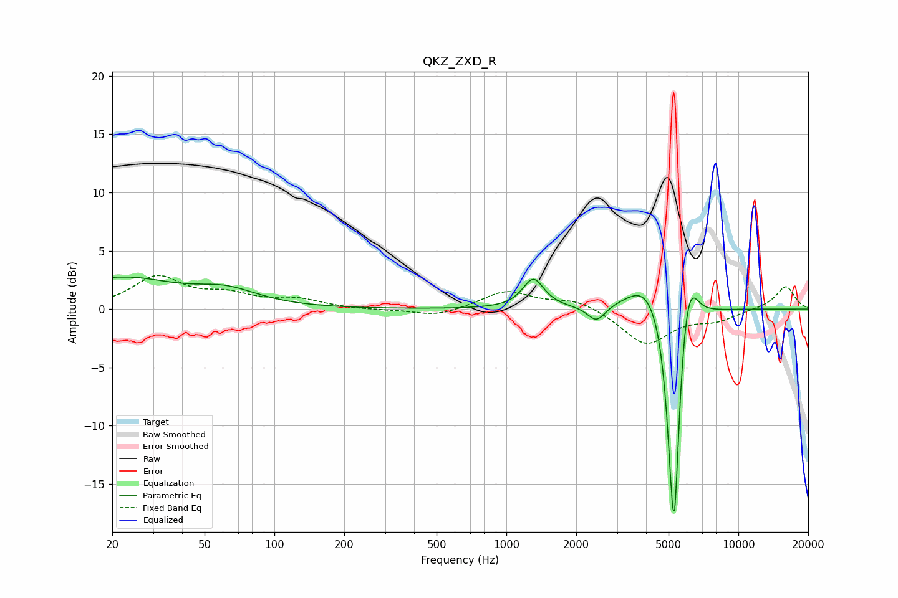

# QKZ_ZXD_R
See [usage instructions](https://github.com/jaakkopasanen/AutoEq#usage) for more options and info.

### Parametric EQs
Apply preamp of -2.8 dB when using parametric equalizer.

|   # | Type    |   Fc (Hz) |    Q |   Gain (dB) |
|-----|---------|-----------|------|-------------|
|   1 | Peaking |        20 | 5.86 |         0.1 |
|   2 | Peaking |        22 | 0.66 |         2.5 |
|   3 | Peaking |        62 | 1.03 |         1.3 |
|   4 | Peaking |      1307 | 3.15 |         2.5 |
|   5 | Peaking |      2446 | 3.72 |        -1.4 |
|   6 | Peaking |      4051 | 1.64 |         2.8 |
|   7 | Peaking |      5164 | 6    |        -4.7 |
|   8 | Peaking |      5299 | 5.69 |       -17   |
|   9 | Peaking |      5872 | 4.63 |         2.3 |
|  10 | Peaking |      6226 | 3.87 |         3   |

### Fixed Band EQs
When using fixed band (also called graphic) equalizer, apply preamp of **-3.0 dB** (if available) and set gains manually with these parameters.

|   # | Type    |   Fc (Hz) |    Q |   Gain (dB) |
|-----|---------|-----------|------|-------------|
|   1 | Peaking |        31 | 1.41 |         2.7 |
|   2 | Peaking |        62 | 1.41 |         1   |
|   3 | Peaking |       125 | 1.41 |         0.7 |
|   4 | Peaking |       250 | 1.41 |        -0.1 |
|   5 | Peaking |       500 | 1.41 |        -0.7 |
|   6 | Peaking |      1000 | 1.41 |         1.5 |
|   7 | Peaking |      2000 | 1.41 |         0.9 |
|   8 | Peaking |      4000 | 1.41 |        -3   |
|   9 | Peaking |      8000 | 1.41 |        -0.8 |
|  10 | Peaking |     16000 | 1.41 |         2   |

### Graphs

