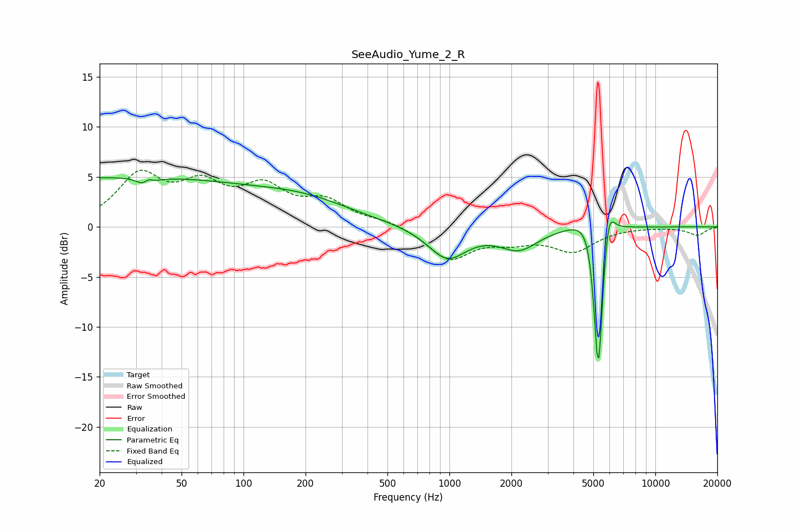

# SeeAudio_Yume_2_R
See [usage instructions](https://github.com/jaakkopasanen/AutoEq#usage) for more options and info.

### Parametric EQs
Apply preamp of -5.0 dB when using parametric equalizer.

|   # | Type    |   Fc (Hz) |    Q |   Gain (dB) |
|-----|---------|-----------|------|-------------|
|   1 | Peaking |        25 | 0.18 |         4.9 |
|   2 | Peaking |        34 | 4.77 |        -3.8 |
|   3 | Peaking |        34 | 5.51 |         3.4 |
|   4 | Peaking |       205 | 0.6  |         1.8 |
|   5 | Peaking |       976 | 1.5  |        -3.2 |
|   6 | Peaking |      2173 | 1.54 |        -2.1 |
|   7 | Peaking |      4943 | 2.13 |         2.9 |
|   8 | Peaking |      5282 | 6    |       -13.2 |
|   9 | Peaking |      5301 | 6    |        -4.1 |
|  10 | Peaking |      5905 | 5.11 |         3.7 |

### Fixed Band EQs
When using fixed band (also called graphic) equalizer, apply preamp of **-5.8 dB** (if available) and set gains manually with these parameters.

|   # | Type    |   Fc (Hz) |    Q |   Gain (dB) |
|-----|---------|-----------|------|-------------|
|   1 | Peaking |        31 | 1.41 |         4.8 |
|   2 | Peaking |        62 | 1.41 |         3.5 |
|   3 | Peaking |       125 | 1.41 |         3.5 |
|   4 | Peaking |       250 | 1.41 |         2.3 |
|   5 | Peaking |       500 | 1.41 |         0.6 |
|   6 | Peaking |      1000 | 1.41 |        -3.2 |
|   7 | Peaking |      2000 | 1.41 |        -1.1 |
|   8 | Peaking |      4000 | 1.41 |        -2.3 |
|   9 | Peaking |      8000 | 1.41 |         0   |
|  10 | Peaking |     16000 | 1.41 |        -0.8 |

### Graphs

