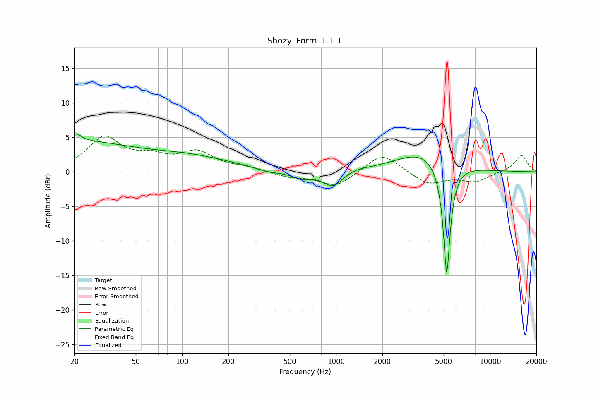

# Shozy_Form_1.1_L
See [usage instructions](https://github.com/jaakkopasanen/AutoEq#usage) for more options and info.

### Parametric EQs
Apply preamp of -5.6 dB when using parametric equalizer.

|   # | Type    |   Fc (Hz) |    Q |   Gain (dB) |
|-----|---------|-----------|------|-------------|
|   1 | Peaking |        20 | 0.38 |         4.2 |
|   2 | Peaking |        21 | 5.5  |         3.3 |
|   3 | Peaking |        21 | 6    |        -2.2 |
|   4 | Peaking |       112 | 0.49 |         1.9 |
|   5 | Peaking |       370 | 1.66 |        -0.5 |
|   6 | Peaking |       602 | 2.08 |        -1   |
|   7 | Peaking |       956 | 2.24 |        -2.3 |
|   8 | Peaking |      1341 | 1.86 |         0.3 |
|   9 | Peaking |      3690 | 0.8  |         3   |
|  10 | Peaking |      5234 | 6    |       -16.9 |

### Fixed Band EQs
When using fixed band (also called graphic) equalizer, apply preamp of **-5.3 dB** (if available) and set gains manually with these parameters.

|   # | Type    |   Fc (Hz) |    Q |   Gain (dB) |
|-----|---------|-----------|------|-------------|
|   1 | Peaking |        31 | 1.41 |         4.8 |
|   2 | Peaking |        62 | 1.41 |         1.7 |
|   3 | Peaking |       125 | 1.41 |         2.6 |
|   4 | Peaking |       250 | 1.41 |         0.5 |
|   5 | Peaking |       500 | 1.41 |        -0.7 |
|   6 | Peaking |      1000 | 1.41 |        -2.2 |
|   7 | Peaking |      2000 | 1.41 |         2.8 |
|   8 | Peaking |      4000 | 1.41 |        -1.8 |
|   9 | Peaking |      8000 | 1.41 |        -1.3 |
|  10 | Peaking |     16000 | 1.41 |         2.4 |

### Graphs

