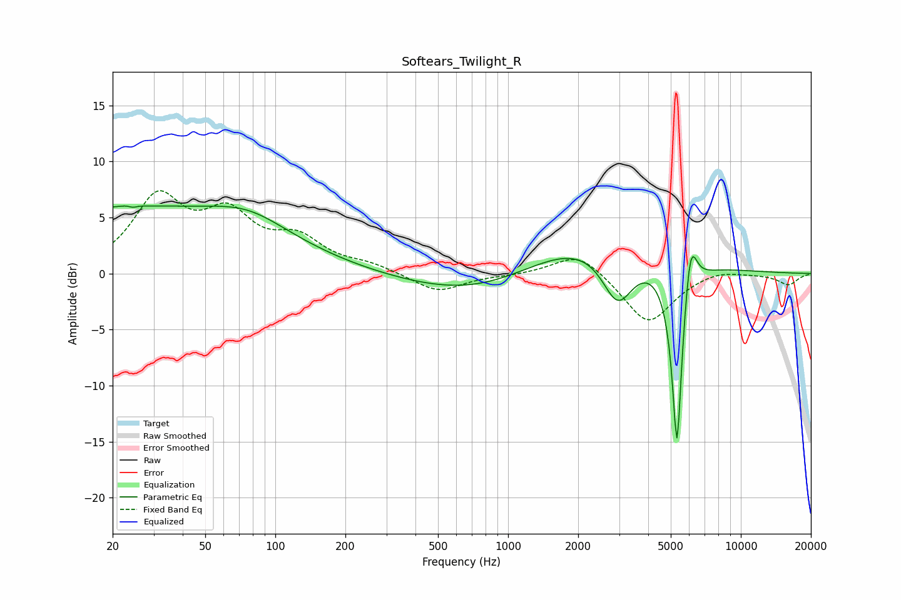

# Softears_Twilight_R
See [usage instructions](https://github.com/jaakkopasanen/AutoEq#usage) for more options and info.

### Parametric EQs
Apply preamp of -6.1 dB when using parametric equalizer.

|   # | Type    |   Fc (Hz) |    Q |   Gain (dB) |
|-----|---------|-----------|------|-------------|
|   1 | Peaking |        22 | 0.2  |         5.8 |
|   2 | Peaking |        24 | 5.69 |         3.1 |
|   3 | Peaking |        24 | 5.96 |        -3.1 |
|   4 | Peaking |        77 | 0.88 |         1.6 |
|   5 | Peaking |       841 | 0.45 |        -2.7 |
|   6 | Peaking |      2176 | 0.45 |         4.2 |
|   7 | Peaking |      2959 | 2.06 |        -5   |
|   8 | Peaking |      5320 | 6    |       -17.4 |
|   9 | Peaking |      6024 | 5.84 |         2.9 |
|  10 | Peaking |      6163 | 5.17 |         2.1 |

### Fixed Band EQs
When using fixed band (also called graphic) equalizer, apply preamp of **-7.5 dB** (if available) and set gains manually with these parameters.

|   # | Type    |   Fc (Hz) |    Q |   Gain (dB) |
|-----|---------|-----------|------|-------------|
|   1 | Peaking |        31 | 1.41 |         6.4 |
|   2 | Peaking |        62 | 1.41 |         4.6 |
|   3 | Peaking |       125 | 1.41 |         2.7 |
|   4 | Peaking |       250 | 1.41 |         0.7 |
|   5 | Peaking |       500 | 1.41 |        -1.7 |
|   6 | Peaking |      1000 | 1.41 |        -0.1 |
|   7 | Peaking |      2000 | 1.41 |         2.1 |
|   8 | Peaking |      4000 | 1.41 |        -4.5 |
|   9 | Peaking |      8000 | 1.41 |         0.5 |
|  10 | Peaking |     16000 | 1.41 |        -1   |

### Graphs

