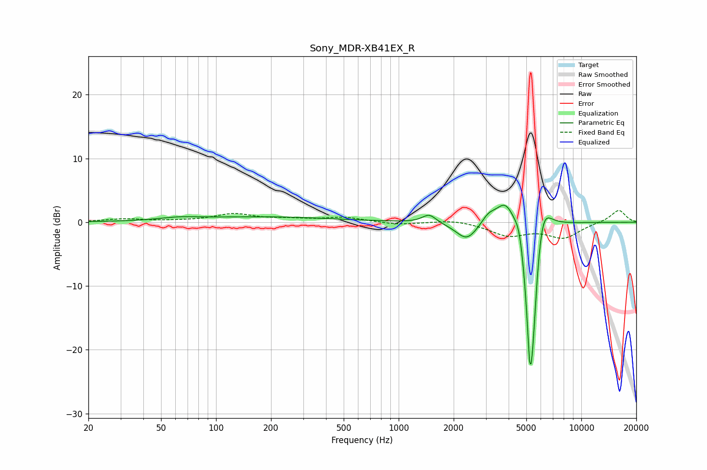

# Sony_MDR-XB41EX_R
See [usage instructions](https://github.com/jaakkopasanen/AutoEq#usage) for more options and info.

### Parametric EQs
Apply preamp of -2.7 dB when using parametric equalizer.

|   # | Type    |   Fc (Hz) |    Q |   Gain (dB) |
|-----|---------|-----------|------|-------------|
|   1 | Peaking |        63 | 1.37 |         0.4 |
|   2 | Peaking |       182 | 0.36 |         0.8 |
|   3 | Peaking |      1469 | 3.81 |         1.3 |
|   4 | Peaking |      2362 | 2.39 |        -2.9 |
|   5 | Peaking |      3098 | 3.91 |         1.2 |
|   6 | Peaking |      3874 | 2.51 |         4.3 |
|   7 | Peaking |      4570 | 5.98 |         2.5 |
|   8 | Peaking |      5236 | 5.7  |       -19.6 |
|   9 | Peaking |      5435 | 6    |        -9.6 |
|  10 | Peaking |      6102 | 3.15 |         6.1 |

### Fixed Band EQs
When using fixed band (also called graphic) equalizer, apply preamp of **-1.9 dB** (if available) and set gains manually with these parameters.

|   # | Type    |   Fc (Hz) |    Q |   Gain (dB) |
|-----|---------|-----------|------|-------------|
|   1 | Peaking |        31 | 1.41 |         0.5 |
|   2 | Peaking |        62 | 1.41 |         0.1 |
|   3 | Peaking |       125 | 1.41 |         1.2 |
|   4 | Peaking |       250 | 1.41 |         0.4 |
|   5 | Peaking |       500 | 1.41 |         0.7 |
|   6 | Peaking |      1000 | 1.41 |        -0.4 |
|   7 | Peaking |      2000 | 1.41 |         0.5 |
|   8 | Peaking |      4000 | 1.41 |        -2   |
|   9 | Peaking |      8000 | 1.41 |        -2.3 |
|  10 | Peaking |     16000 | 1.41 |         2   |

### Graphs

