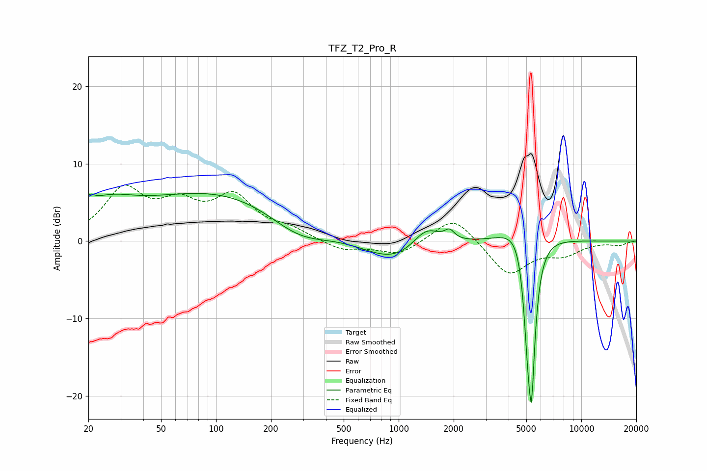

# TFZ_T2_Pro_R
See [usage instructions](https://github.com/jaakkopasanen/AutoEq#usage) for more options and info.

### Parametric EQs
Apply preamp of -6.3 dB when using parametric equalizer.

|   # | Type    |   Fc (Hz) |    Q |   Gain (dB) |
|-----|---------|-----------|------|-------------|
|   1 | Peaking |        20 | 5.77 |         1.2 |
|   2 | Peaking |        24 | 0.91 |         3.3 |
|   3 | Peaking |       117 | 0.29 |         6.6 |
|   4 | Peaking |       283 | 0.78 |        -3.7 |
|   5 | Peaking |       946 | 0.81 |        -3.1 |
|   6 | Peaking |      1417 | 1.81 |         2.9 |
|   7 | Peaking |      1899 | 5.43 |         1.2 |
|   8 | Peaking |      4903 | 1.64 |         4.9 |
|   9 | Peaking |      5090 | 5.97 |        -8.6 |
|  10 | Peaking |      5338 | 5.99 |       -19.2 |

### Fixed Band EQs
When using fixed band (also called graphic) equalizer, apply preamp of **-7.3 dB** (if available) and set gains manually with these parameters.

|   # | Type    |   Fc (Hz) |    Q |   Gain (dB) |
|-----|---------|-----------|------|-------------|
|   1 | Peaking |        31 | 1.41 |         6.3 |
|   2 | Peaking |        62 | 1.41 |         3.9 |
|   3 | Peaking |       125 | 1.41 |         5.3 |
|   4 | Peaking |       250 | 1.41 |         1.3 |
|   5 | Peaking |       500 | 1.41 |        -1.3 |
|   6 | Peaking |      1000 | 1.41 |        -1.8 |
|   7 | Peaking |      2000 | 1.41 |         3.5 |
|   8 | Peaking |      4000 | 1.41 |        -4.4 |
|   9 | Peaking |      8000 | 1.41 |        -1.5 |
|  10 | Peaking |     16000 | 1.41 |        -0.5 |

### Graphs

