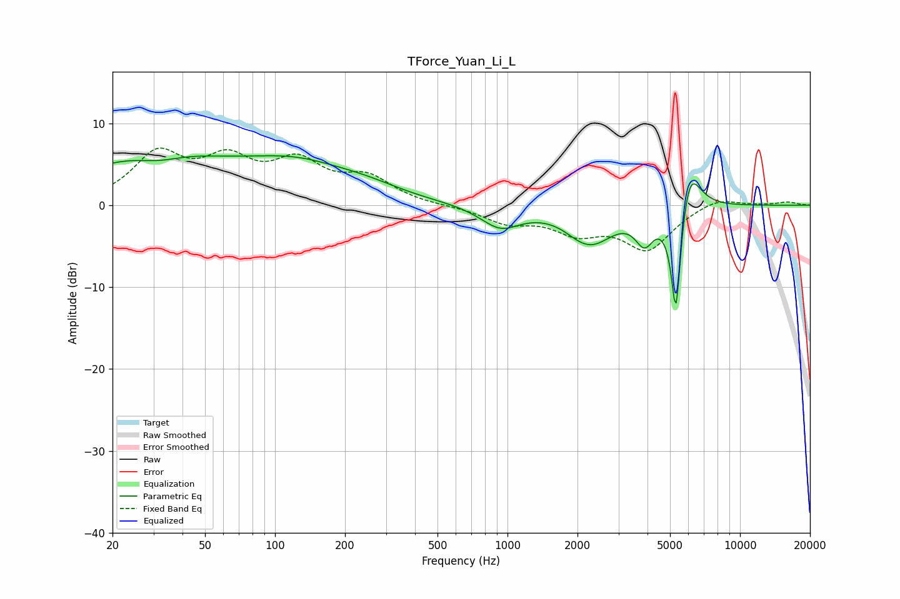

# TForce_Yuan_Li_L
See [usage instructions](https://github.com/jaakkopasanen/AutoEq#usage) for more options and info.

### Parametric EQs
Apply preamp of -6.1 dB when using parametric equalizer.

|   # | Type    |   Fc (Hz) |    Q |   Gain (dB) |
|-----|---------|-----------|------|-------------|
|   1 | Peaking |        30 | 0.44 |         6   |
|   2 | Peaking |        31 | 1.38 |        -1.2 |
|   3 | Peaking |       126 | 0.6  |         4.1 |
|   4 | Peaking |       251 | 0.96 |         1   |
|   5 | Peaking |       932 | 1.65 |        -2.7 |
|   6 | Peaking |      1985 | 2.58 |        -0.4 |
|   7 | Peaking |      2301 | 1.45 |        -4.2 |
|   8 | Peaking |      3884 | 3.55 |        -3.6 |
|   9 | Peaking |      5304 | 6    |       -15   |
|  10 | Peaking |      6027 | 2.93 |         6.6 |

### Fixed Band EQs
When using fixed band (also called graphic) equalizer, apply preamp of **-7.1 dB** (if available) and set gains manually with these parameters.

|   # | Type    |   Fc (Hz) |    Q |   Gain (dB) |
|-----|---------|-----------|------|-------------|
|   1 | Peaking |        31 | 1.41 |         5.9 |
|   2 | Peaking |        62 | 1.41 |         4.7 |
|   3 | Peaking |       125 | 1.41 |         4.6 |
|   4 | Peaking |       250 | 1.41 |         3   |
|   5 | Peaking |       500 | 1.41 |        -0.1 |
|   6 | Peaking |      1000 | 1.41 |        -1.9 |
|   7 | Peaking |      2000 | 1.41 |        -2.9 |
|   8 | Peaking |      4000 | 1.41 |        -5.2 |
|   9 | Peaking |      8000 | 1.41 |         1.1 |
|  10 | Peaking |     16000 | 1.41 |         0.4 |

### Graphs

