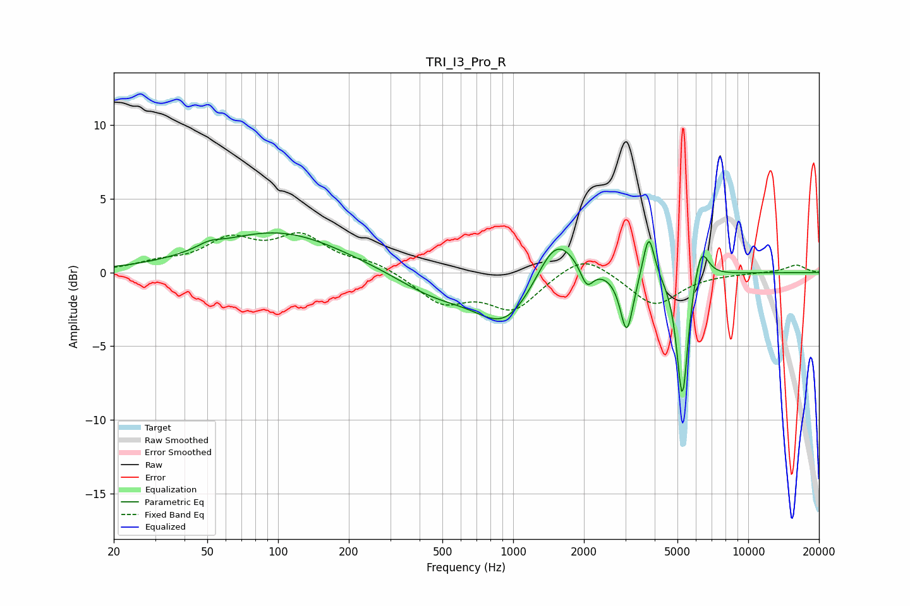

# TRI_I3_Pro_R
See [usage instructions](https://github.com/jaakkopasanen/AutoEq#usage) for more options and info.

### Parametric EQs
Apply preamp of -2.8 dB when using parametric equalizer.

|   # | Type    |   Fc (Hz) |    Q |   Gain (dB) |
|-----|---------|-----------|------|-------------|
|   1 | Peaking |        51 | 2.81 |         0.4 |
|   2 | Peaking |       100 | 0.51 |         2.8 |
|   3 | Peaking |       460 | 0.87 |        -1.4 |
|   4 | Peaking |       929 | 1.11 |        -3.4 |
|   5 | Peaking |      1525 | 1.68 |         3.3 |
|   6 | Peaking |      2058 | 5.34 |        -1.4 |
|   7 | Peaking |      3043 | 5.26 |        -4.1 |
|   8 | Peaking |      3774 | 6    |         3.2 |
|   9 | Peaking |      5246 | 5.89 |        -8.8 |
|  10 | Peaking |      6301 | 4.47 |         2.4 |

### Fixed Band EQs
When using fixed band (also called graphic) equalizer, apply preamp of **-2.8 dB** (if available) and set gains manually with these parameters.

|   # | Type    |   Fc (Hz) |    Q |   Gain (dB) |
|-----|---------|-----------|------|-------------|
|   1 | Peaking |        31 | 1.41 |         0.5 |
|   2 | Peaking |        62 | 1.41 |         2   |
|   3 | Peaking |       125 | 1.41 |         2.3 |
|   4 | Peaking |       250 | 1.41 |         0.6 |
|   5 | Peaking |       500 | 1.41 |        -2   |
|   6 | Peaking |      1000 | 1.41 |        -2.4 |
|   7 | Peaking |      2000 | 1.41 |         1.5 |
|   8 | Peaking |      4000 | 1.41 |        -2.3 |
|   9 | Peaking |      8000 | 1.41 |        -0   |
|  10 | Peaking |     16000 | 1.41 |         0.5 |

### Graphs

