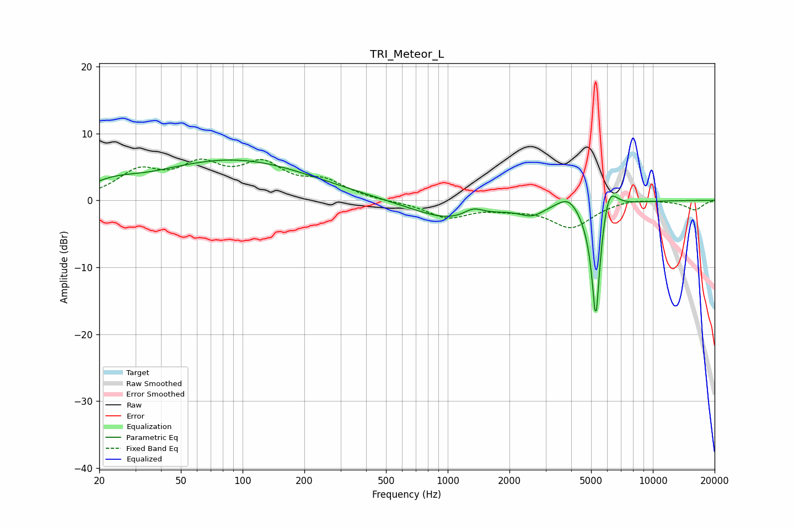

# TRI_Meteor_L
See [usage instructions](https://github.com/jaakkopasanen/AutoEq#usage) for more options and info.

### Parametric EQs
Apply preamp of -6.1 dB when using parametric equalizer.

|   # | Type    |   Fc (Hz) |    Q |   Gain (dB) |
|-----|---------|-----------|------|-------------|
|   1 | Peaking |        21 | 5.86 |         0   |
|   2 | Peaking |        23 | 1.26 |         1.4 |
|   3 | Peaking |        89 | 0.38 |         1.6 |
|   4 | Peaking |        90 | 0.37 |         4.4 |
|   5 | Peaking |      1049 | 0.73 |        -3   |
|   6 | Peaking |      1333 | 2.94 |         1.3 |
|   7 | Peaking |      2579 | 2.27 |        -1.5 |
|   8 | Peaking |      3886 | 2.61 |         2   |
|   9 | Peaking |      5273 | 6    |       -19.6 |
|  10 | Peaking |      6075 | 3.6  |         5.1 |

### Fixed Band EQs
When using fixed band (also called graphic) equalizer, apply preamp of **-6.3 dB** (if available) and set gains manually with these parameters.

|   # | Type    |   Fc (Hz) |    Q |   Gain (dB) |
|-----|---------|-----------|------|-------------|
|   1 | Peaking |        31 | 1.41 |         3.9 |
|   2 | Peaking |        62 | 1.41 |         4.5 |
|   3 | Peaking |       125 | 1.41 |         4.7 |
|   4 | Peaking |       250 | 1.41 |         2.5 |
|   5 | Peaking |       500 | 1.41 |        -0.1 |
|   6 | Peaking |      1000 | 1.41 |        -2.5 |
|   7 | Peaking |      2000 | 1.41 |        -0.8 |
|   8 | Peaking |      4000 | 1.41 |        -3.9 |
|   9 | Peaking |      8000 | 1.41 |         0.4 |
|  10 | Peaking |     16000 | 1.41 |        -1.4 |

### Graphs

