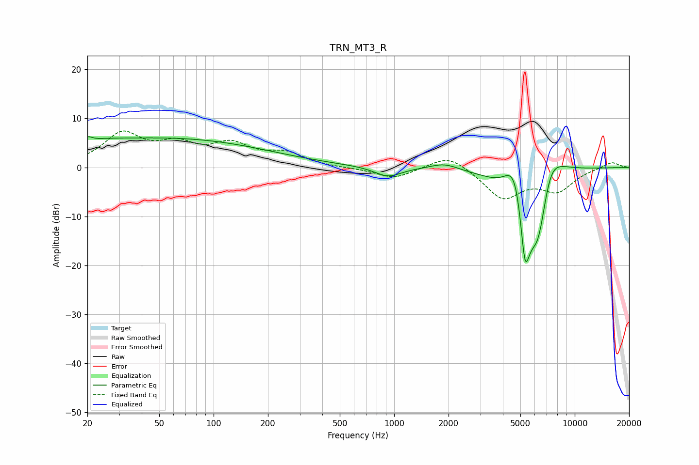

# TRN_MT3_R
See [usage instructions](https://github.com/jaakkopasanen/AutoEq#usage) for more options and info.

### Parametric EQs
Apply preamp of -6.4 dB when using parametric equalizer.

|   # | Type    |   Fc (Hz) |    Q |   Gain (dB) |
|-----|---------|-----------|------|-------------|
|   1 | Peaking |        20 | 5.95 |         1.1 |
|   2 | Peaking |        22 | 1.01 |         1.3 |
|   3 | Peaking |        59 | 0.26 |         5.7 |
|   4 | Peaking |       922 | 1.91 |        -2.1 |
|   5 | Peaking |      1898 | 1.81 |         1.3 |
|   6 | Peaking |      4501 | 2.66 |         5.5 |
|   7 | Peaking |      4832 | 3.35 |         5.5 |
|   8 | Peaking |      5303 | 3.29 |       -20   |
|   9 | Peaking |      6305 | 1.73 |       -18.4 |
|  10 | Peaking |      7240 | 1.46 |        13.1 |

### Fixed Band EQs
When using fixed band (also called graphic) equalizer, apply preamp of **-7.5 dB** (if available) and set gains manually with these parameters.

|   # | Type    |   Fc (Hz) |    Q |   Gain (dB) |
|-----|---------|-----------|------|-------------|
|   1 | Peaking |        31 | 1.41 |         6.5 |
|   2 | Peaking |        62 | 1.41 |         3.8 |
|   3 | Peaking |       125 | 1.41 |         4.1 |
|   4 | Peaking |       250 | 1.41 |         2.6 |
|   5 | Peaking |       500 | 1.41 |        -0.1 |
|   6 | Peaking |      1000 | 1.41 |        -2.3 |
|   7 | Peaking |      2000 | 1.41 |         3   |
|   8 | Peaking |      4000 | 1.41 |        -6.2 |
|   9 | Peaking |      8000 | 1.41 |        -4.4 |
|  10 | Peaking |     16000 | 1.41 |         1.2 |

### Graphs

