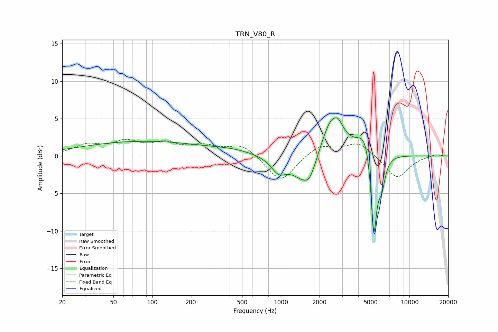

# TRN_V80_R
See [usage instructions](https://github.com/jaakkopasanen/AutoEq#usage) for more options and info.

### Parametric EQs
Apply preamp of -5.2 dB when using parametric equalizer.

|   # | Type    |   Fc (Hz) |    Q |   Gain (dB) |
|-----|---------|-----------|------|-------------|
|   1 | Peaking |        85 | 0.28 |         1.9 |
|   2 | Peaking |       431 | 0.89 |         0.5 |
|   3 | Peaking |       962 | 2.45 |        -1.9 |
|   4 | Peaking |      1550 | 1.39 |        -3.7 |
|   5 | Peaking |      1681 | 3.35 |        -1.3 |
|   6 | Peaking |      2498 | 1.65 |         5.9 |
|   7 | Peaking |      2819 | 5.59 |         0.6 |
|   8 | Peaking |      4598 | 2.29 |         3.5 |
|   9 | Peaking |      5279 | 6    |       -11.9 |
|  10 | Peaking |      6067 | 4.78 |        -3.7 |

### Fixed Band EQs
When using fixed band (also called graphic) equalizer, apply preamp of **-2.3 dB** (if available) and set gains manually with these parameters.

|   # | Type    |   Fc (Hz) |    Q |   Gain (dB) |
|-----|---------|-----------|------|-------------|
|   1 | Peaking |        31 | 1.41 |         1.3 |
|   2 | Peaking |        62 | 1.41 |         1.7 |
|   3 | Peaking |       125 | 1.41 |         1.4 |
|   4 | Peaking |       250 | 1.41 |         1.1 |
|   5 | Peaking |       500 | 1.41 |         1.6 |
|   6 | Peaking |      1000 | 1.41 |        -3.6 |
|   7 | Peaking |      2000 | 1.41 |         1.5 |
|   8 | Peaking |      4000 | 1.41 |         1.8 |
|   9 | Peaking |      8000 | 1.41 |        -3   |
|  10 | Peaking |     16000 | 1.41 |         0.3 |

### Graphs

