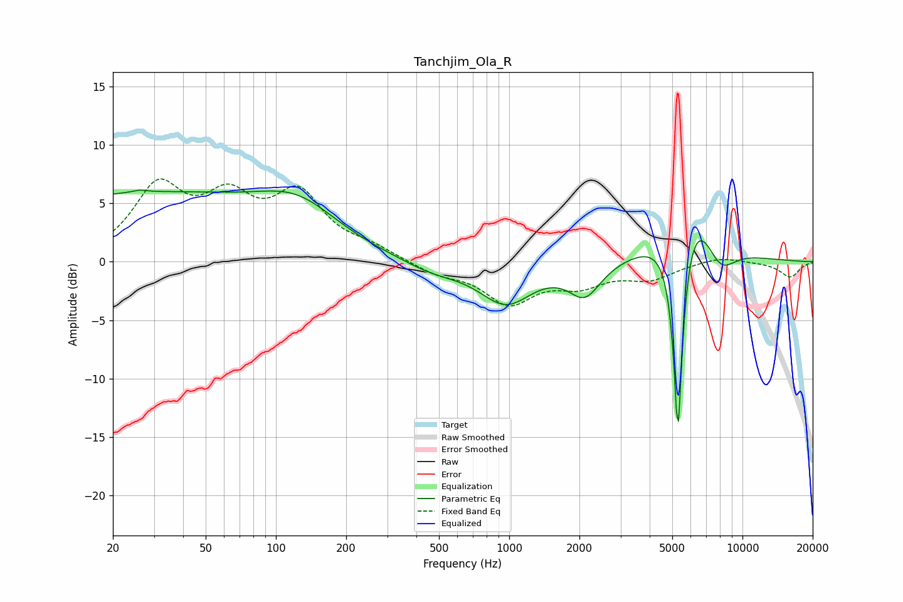

# Tanchjim_Ola_R
See [usage instructions](https://github.com/jaakkopasanen/AutoEq#usage) for more options and info.

### Parametric EQs
Apply preamp of -6.2 dB when using parametric equalizer.

|   # | Type    |   Fc (Hz) |    Q |   Gain (dB) |
|-----|---------|-----------|------|-------------|
|   1 | Peaking |        20 | 0.28 |         5.3 |
|   2 | Peaking |        26 | 5.01 |         0.2 |
|   3 | Peaking |        75 | 0.5  |         1.5 |
|   4 | Peaking |       125 | 0.8  |         3.3 |
|   5 | Peaking |       469 | 1.12 |        -0.9 |
|   6 | Peaking |       968 | 1.25 |        -3.5 |
|   7 | Peaking |      2110 | 2.07 |        -2.8 |
|   8 | Peaking |      5289 | 6    |       -20   |
|   9 | Peaking |      5915 | 1.25 |         7.5 |
|  10 | Peaking |      7993 | 1.93 |        -3   |

### Fixed Band EQs
When using fixed band (also called graphic) equalizer, apply preamp of **-7.2 dB** (if available) and set gains manually with these parameters.

|   # | Type    |   Fc (Hz) |    Q |   Gain (dB) |
|-----|---------|-----------|------|-------------|
|   1 | Peaking |        31 | 1.41 |         6   |
|   2 | Peaking |        62 | 1.41 |         4.5 |
|   3 | Peaking |       125 | 1.41 |         5.3 |
|   4 | Peaking |       250 | 1.41 |         1   |
|   5 | Peaking |       500 | 1.41 |        -0.9 |
|   6 | Peaking |      1000 | 1.41 |        -3.4 |
|   7 | Peaking |      2000 | 1.41 |        -1.7 |
|   8 | Peaking |      4000 | 1.41 |        -1.3 |
|   9 | Peaking |      8000 | 1.41 |         0.5 |
|  10 | Peaking |     16000 | 1.41 |        -1.3 |

### Graphs

