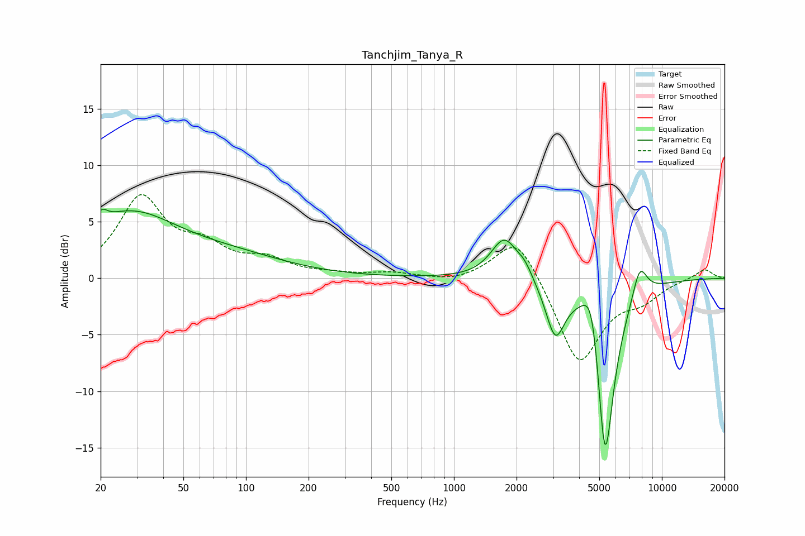

# Tanchjim_Tanya_R
See [usage instructions](https://github.com/jaakkopasanen/AutoEq#usage) for more options and info.

### Parametric EQs
Apply preamp of -6.2 dB when using parametric equalizer.

|   # | Type    |   Fc (Hz) |    Q |   Gain (dB) |
|-----|---------|-----------|------|-------------|
|   1 | Peaking |        20 | 5.65 |         1   |
|   2 | Peaking |        27 | 0.59 |         5.5 |
|   3 | Peaking |        90 | 0.53 |         1.4 |
|   4 | Peaking |      1749 | 2.19 |         3.7 |
|   5 | Peaking |      2195 | 3.83 |         0.9 |
|   6 | Peaking |      3070 | 3.12 |        -4.6 |
|   7 | Peaking |      4612 | 3.15 |         5.1 |
|   8 | Peaking |      5244 | 6    |        -2.4 |
|   9 | Peaking |      5362 | 2.8  |       -15.1 |
|  10 | Peaking |      7818 | 3.71 |         2.9 |

### Fixed Band EQs
When using fixed band (also called graphic) equalizer, apply preamp of **-7.5 dB** (if available) and set gains manually with these parameters.

|   # | Type    |   Fc (Hz) |    Q |   Gain (dB) |
|-----|---------|-----------|------|-------------|
|   1 | Peaking |        31 | 1.41 |         6.9 |
|   2 | Peaking |        62 | 1.41 |         2.3 |
|   3 | Peaking |       125 | 1.41 |         1.4 |
|   4 | Peaking |       250 | 1.41 |         0.3 |
|   5 | Peaking |       500 | 1.41 |         0.4 |
|   6 | Peaking |      1000 | 1.41 |        -0.4 |
|   7 | Peaking |      2000 | 1.41 |         4.1 |
|   8 | Peaking |      4000 | 1.41 |        -7.7 |
|   9 | Peaking |      8000 | 1.41 |        -1.5 |
|  10 | Peaking |     16000 | 1.41 |         0.9 |

### Graphs

