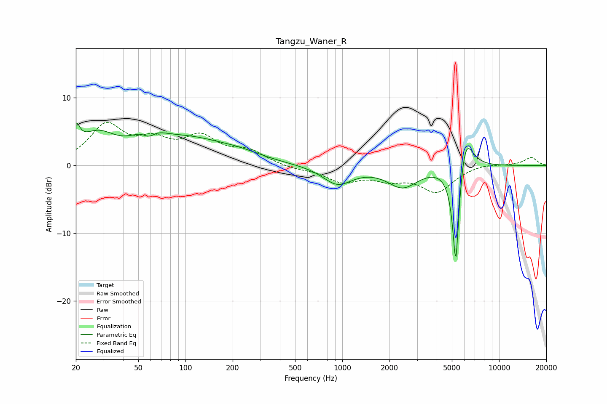

# Tangzu_Waner_R
See [usage instructions](https://github.com/jaakkopasanen/AutoEq#usage) for more options and info.

### Parametric EQs
Apply preamp of -6.4 dB when using parametric equalizer.

|   # | Type    |   Fc (Hz) |    Q |   Gain (dB) |
|-----|---------|-----------|------|-------------|
|   1 | Peaking |        20 | 5.76 |         3.2 |
|   2 | Peaking |        27 | 1.2  |         4   |
|   3 | Peaking |        58 | 1.85 |         3.9 |
|   4 | Peaking |        58 | 3.04 |        -2.7 |
|   5 | Peaking |       104 | 0.6  |         3.5 |
|   6 | Peaking |       222 | 0.93 |         0.9 |
|   7 | Peaking |       932 | 1.51 |        -2.7 |
|   8 | Peaking |      2427 | 1.46 |        -3   |
|   9 | Peaking |      5298 | 6    |       -17.1 |
|  10 | Peaking |      6053 | 2.89 |         6.7 |

### Fixed Band EQs
When using fixed band (also called graphic) equalizer, apply preamp of **-6.5 dB** (if available) and set gains manually with these parameters.

|   # | Type    |   Fc (Hz) |    Q |   Gain (dB) |
|-----|---------|-----------|------|-------------|
|   1 | Peaking |        31 | 1.41 |         5.7 |
|   2 | Peaking |        62 | 1.41 |         2.9 |
|   3 | Peaking |       125 | 1.41 |         3.7 |
|   4 | Peaking |       250 | 1.41 |         1.9 |
|   5 | Peaking |       500 | 1.41 |        -0.5 |
|   6 | Peaking |      1000 | 1.41 |        -2.2 |
|   7 | Peaking |      2000 | 1.41 |        -1.6 |
|   8 | Peaking |      4000 | 1.41 |        -3.7 |
|   9 | Peaking |      8000 | 1.41 |         0.4 |
|  10 | Peaking |     16000 | 1.41 |         1.2 |

### Graphs

