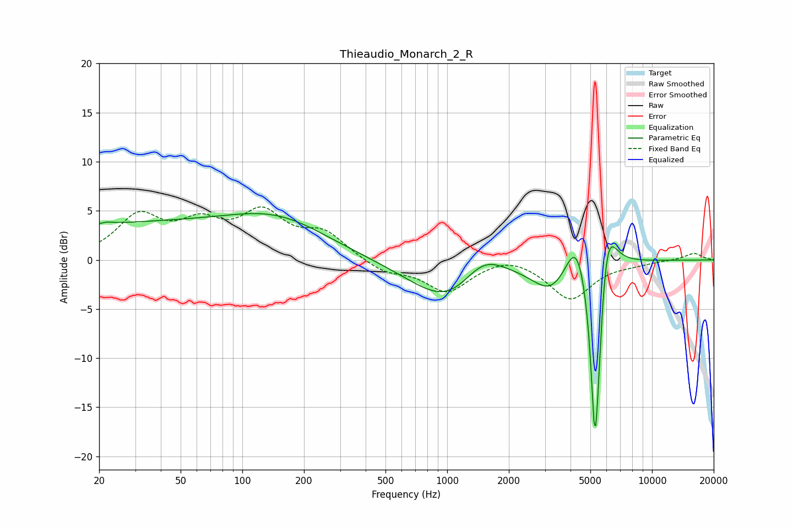

# Thieaudio_Monarch_2_R
See [usage instructions](https://github.com/jaakkopasanen/AutoEq#usage) for more options and info.

### Parametric EQs
Apply preamp of -4.8 dB when using parametric equalizer.

|   # | Type    |   Fc (Hz) |    Q |   Gain (dB) |
|-----|---------|-----------|------|-------------|
|   1 | Peaking |        22 | 5.28 |         0.2 |
|   2 | Peaking |        35 | 0.18 |         3.6 |
|   3 | Peaking |       155 | 0.62 |         2.3 |
|   4 | Peaking |      1047 | 0.75 |        -4.9 |
|   5 | Peaking |      1487 | 1.27 |         3.3 |
|   6 | Peaking |      3220 | 1.57 |        -2.9 |
|   7 | Peaking |      4262 | 2.76 |         4.2 |
|   8 | Peaking |      5259 | 6    |       -16.4 |
|   9 | Peaking |      5406 | 6    |        -5.4 |
|  10 | Peaking |      6013 | 3.22 |         6   |

### Fixed Band EQs
When using fixed band (also called graphic) equalizer, apply preamp of **-5.5 dB** (if available) and set gains manually with these parameters.

|   # | Type    |   Fc (Hz) |    Q |   Gain (dB) |
|-----|---------|-----------|------|-------------|
|   1 | Peaking |        31 | 1.41 |         4.2 |
|   2 | Peaking |        62 | 1.41 |         3.1 |
|   3 | Peaking |       125 | 1.41 |         4.3 |
|   4 | Peaking |       250 | 1.41 |         2.5 |
|   5 | Peaking |       500 | 1.41 |        -1.2 |
|   6 | Peaking |      1000 | 1.41 |        -3.1 |
|   7 | Peaking |      2000 | 1.41 |         0.7 |
|   8 | Peaking |      4000 | 1.41 |        -3.9 |
|   9 | Peaking |      8000 | 1.41 |        -0.3 |
|  10 | Peaking |     16000 | 1.41 |         0.7 |

### Graphs

