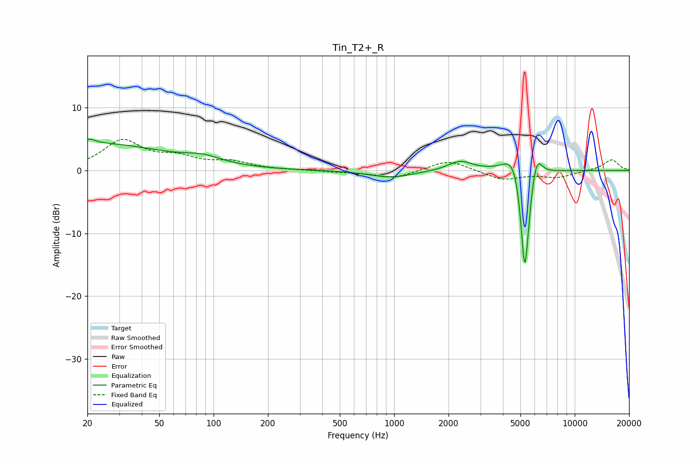

# Tin_T2+_R
See [usage instructions](https://github.com/jaakkopasanen/AutoEq#usage) for more options and info.

### Parametric EQs
Apply preamp of -5.1 dB when using parametric equalizer.

|   # | Type    |   Fc (Hz) |    Q |   Gain (dB) |
|-----|---------|-----------|------|-------------|
|   1 | Peaking |        21 | 5.68 |         3.4 |
|   2 | Peaking |        21 | 5.98 |        -2.6 |
|   3 | Peaking |        22 | 0.35 |         4.2 |
|   4 | Peaking |        88 | 1.4  |         1.1 |
|   5 | Peaking |       962 | 1.17 |        -1.1 |
|   6 | Peaking |      2320 | 2.15 |         1.5 |
|   7 | Peaking |      4603 | 2.65 |         3.7 |
|   8 | Peaking |      5279 | 6    |       -14.3 |
|   9 | Peaking |      5344 | 6    |        -3.9 |
|  10 | Peaking |      6160 | 4.9  |         3.7 |

### Fixed Band EQs
When using fixed band (also called graphic) equalizer, apply preamp of **-5.0 dB** (if available) and set gains manually with these parameters.

|   # | Type    |   Fc (Hz) |    Q |   Gain (dB) |
|-----|---------|-----------|------|-------------|
|   1 | Peaking |        31 | 1.41 |         4.6 |
|   2 | Peaking |        62 | 1.41 |         1.7 |
|   3 | Peaking |       125 | 1.41 |         1.2 |
|   4 | Peaking |       250 | 1.41 |         0   |
|   5 | Peaking |       500 | 1.41 |        -0.2 |
|   6 | Peaking |      1000 | 1.41 |        -1.2 |
|   7 | Peaking |      2000 | 1.41 |         1.8 |
|   8 | Peaking |      4000 | 1.41 |        -1.5 |
|   9 | Peaking |      8000 | 1.41 |        -1   |
|  10 | Peaking |     16000 | 1.41 |         1.7 |

### Graphs

