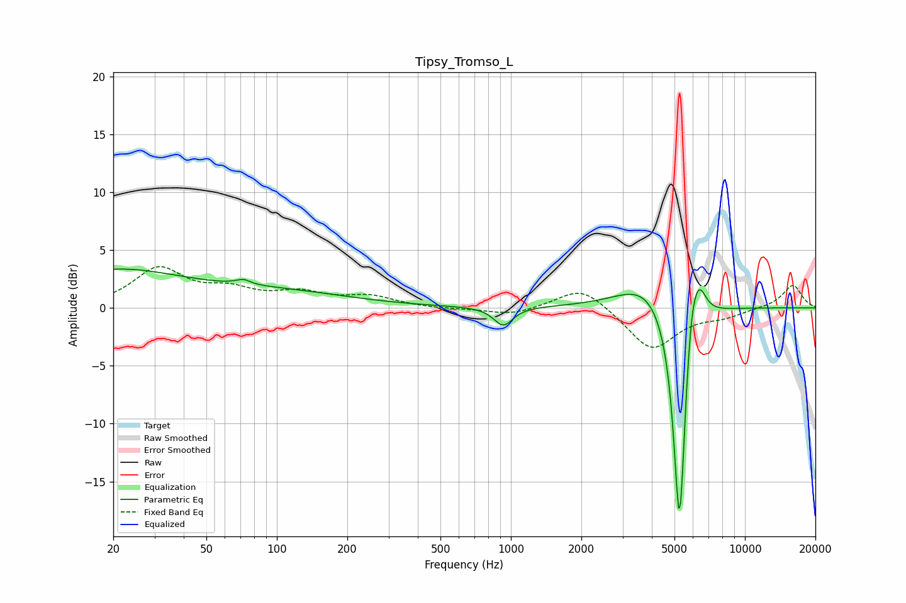

# Tipsy_Tromso_L
See [usage instructions](https://github.com/jaakkopasanen/AutoEq#usage) for more options and info.

### Parametric EQs
Apply preamp of -3.5 dB when using parametric equalizer.

|   # | Type    |   Fc (Hz) |    Q |   Gain (dB) |
|-----|---------|-----------|------|-------------|
|   1 | Peaking |        20 | 0.48 |         3.1 |
|   2 | Peaking |        71 | 6    |        -2.3 |
|   3 | Peaking |        71 | 5.73 |         2.7 |
|   4 | Peaking |       101 | 0.45 |         1.2 |
|   5 | Peaking |       928 | 3.52 |        -1.6 |
|   6 | Peaking |      3835 | 1.14 |         2.5 |
|   7 | Peaking |      5228 | 5.99 |        -4.4 |
|   8 | Peaking |      5265 | 4.79 |       -17   |
|   9 | Peaking |      5890 | 4.86 |         4   |
|  10 | Peaking |      6359 | 4.23 |         3.1 |

### Fixed Band EQs
When using fixed band (also called graphic) equalizer, apply preamp of **-3.7 dB** (if available) and set gains manually with these parameters.

|   # | Type    |   Fc (Hz) |    Q |   Gain (dB) |
|-----|---------|-----------|------|-------------|
|   1 | Peaking |        31 | 1.41 |         3.3 |
|   2 | Peaking |        62 | 1.41 |         1.3 |
|   3 | Peaking |       125 | 1.41 |         1.1 |
|   4 | Peaking |       250 | 1.41 |         0.9 |
|   5 | Peaking |       500 | 1.41 |        -0.1 |
|   6 | Peaking |      1000 | 1.41 |        -0.6 |
|   7 | Peaking |      2000 | 1.41 |         2   |
|   8 | Peaking |      4000 | 1.41 |        -3.6 |
|   9 | Peaking |      8000 | 1.41 |        -0.6 |
|  10 | Peaking |     16000 | 1.41 |         2   |

### Graphs

