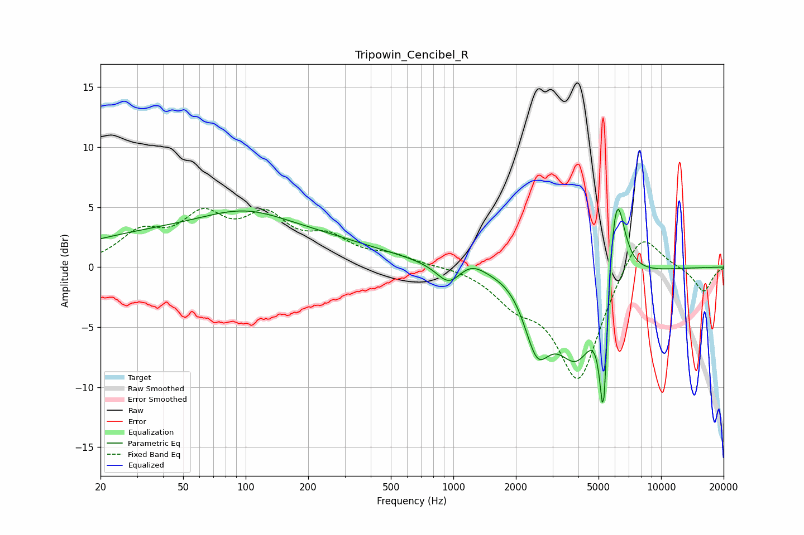

# Tripowin_Cencibel_R
See [usage instructions](https://github.com/jaakkopasanen/AutoEq#usage) for more options and info.

### Parametric EQs
Apply preamp of -4.9 dB when using parametric equalizer.

|   # | Type    |   Fc (Hz) |    Q |   Gain (dB) |
|-----|---------|-----------|------|-------------|
|   1 | Peaking |        75 | 0.18 |         3.2 |
|   2 | Peaking |        99 | 0.72 |         1.6 |
|   3 | Peaking |       951 | 2.38 |        -1.7 |
|   4 | Peaking |      1217 | 2.08 |         0.9 |
|   5 | Peaking |      1946 | 1.69 |         0.5 |
|   6 | Peaking |      2528 | 2.27 |        -5.2 |
|   7 | Peaking |      3950 | 1.32 |        -7.4 |
|   8 | Peaking |      5287 | 6    |       -14.3 |
|   9 | Peaking |      5756 | 2.53 |         7.5 |
|  10 | Peaking |      6148 | 4.07 |         4.5 |

### Fixed Band EQs
When using fixed band (also called graphic) equalizer, apply preamp of **-5.0 dB** (if available) and set gains manually with these parameters.

|   # | Type    |   Fc (Hz) |    Q |   Gain (dB) |
|-----|---------|-----------|------|-------------|
|   1 | Peaking |        31 | 1.41 |         2.5 |
|   2 | Peaking |        62 | 1.41 |         3.7 |
|   3 | Peaking |       125 | 1.41 |         3.6 |
|   4 | Peaking |       250 | 1.41 |         2   |
|   5 | Peaking |       500 | 1.41 |         0.8 |
|   6 | Peaking |      1000 | 1.41 |         0.1 |
|   7 | Peaking |      2000 | 1.41 |        -2.3 |
|   8 | Peaking |      4000 | 1.41 |        -9.4 |
|   9 | Peaking |      8000 | 1.41 |         3.7 |
|  10 | Peaking |     16000 | 1.41 |        -2.1 |

### Graphs

