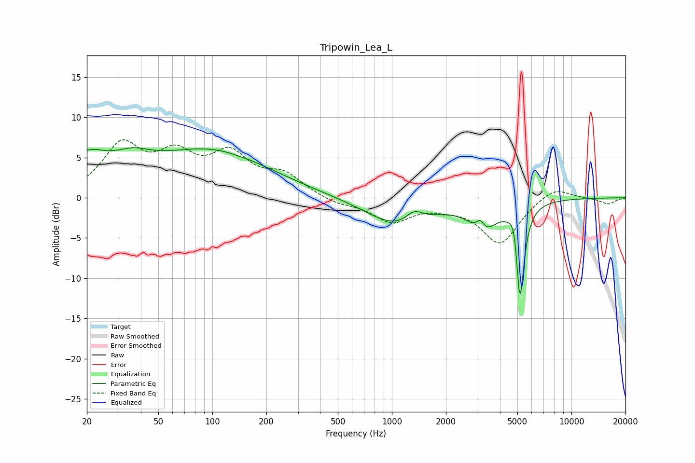

# Tripowin_Lea_L
See [usage instructions](https://github.com/jaakkopasanen/AutoEq#usage) for more options and info.

### Parametric EQs
Apply preamp of -6.3 dB when using parametric equalizer.

|   # | Type    |   Fc (Hz) |    Q |   Gain (dB) |
|-----|---------|-----------|------|-------------|
|   1 | Peaking |        20 | 1.31 |         4   |
|   2 | Peaking |        36 | 1.32 |         2.1 |
|   3 | Peaking |        96 | 0.42 |         5.8 |
|   4 | Peaking |       140 | 4.65 |        -0   |
|   5 | Peaking |      1083 | 0.81 |        -3.5 |
|   6 | Peaking |      1329 | 2.89 |         1.5 |
|   7 | Peaking |      3106 | 5.99 |         1.6 |
|   8 | Peaking |      3197 | 2    |        -3.6 |
|   9 | Peaking |      4828 | 5.89 |         3   |
|  10 | Peaking |      5162 | 6    |       -13   |

### Fixed Band EQs
When using fixed band (also called graphic) equalizer, apply preamp of **-7.3 dB** (if available) and set gains manually with these parameters.

|   # | Type    |   Fc (Hz) |    Q |   Gain (dB) |
|-----|---------|-----------|------|-------------|
|   1 | Peaking |        31 | 1.41 |         6.1 |
|   2 | Peaking |        62 | 1.41 |         4.4 |
|   3 | Peaking |       125 | 1.41 |         4.8 |
|   4 | Peaking |       250 | 1.41 |         2.5 |
|   5 | Peaking |       500 | 1.41 |        -0.8 |
|   6 | Peaking |      1000 | 1.41 |        -2.8 |
|   7 | Peaking |      2000 | 1.41 |        -0.6 |
|   8 | Peaking |      4000 | 1.41 |        -5.6 |
|   9 | Peaking |      8000 | 1.41 |         1.6 |
|  10 | Peaking |     16000 | 1.41 |        -0.8 |

### Graphs

