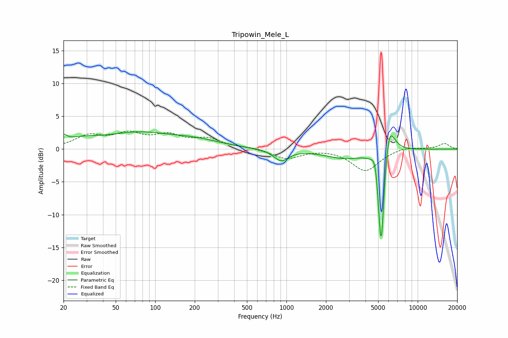

# Tripowin_Mele_L
See [usage instructions](https://github.com/jaakkopasanen/AutoEq#usage) for more options and info.

### Parametric EQs
Apply preamp of -2.7 dB when using parametric equalizer.

|   # | Type    |   Fc (Hz) |    Q |   Gain (dB) |
|-----|---------|-----------|------|-------------|
|   1 | Peaking |        20 | 5.91 |         1   |
|   2 | Peaking |        27 | 1.04 |         1.1 |
|   3 | Peaking |        74 | 0.57 |         2.2 |
|   4 | Peaking |       203 | 0.72 |         1   |
|   5 | Peaking |       910 | 2.54 |        -1.7 |
|   6 | Peaking |      2783 | 0.94 |        -1.4 |
|   7 | Peaking |      4748 | 5.94 |         2.3 |
|   8 | Peaking |      5245 | 6    |        -3.7 |
|   9 | Peaking |      5274 | 6    |       -13   |
|  10 | Peaking |      6030 | 3.29 |         5.6 |

### Fixed Band EQs
When using fixed band (also called graphic) equalizer, apply preamp of **-2.8 dB** (if available) and set gains manually with these parameters.

|   # | Type    |   Fc (Hz) |    Q |   Gain (dB) |
|-----|---------|-----------|------|-------------|
|   1 | Peaking |        31 | 1.41 |         1.9 |
|   2 | Peaking |        62 | 1.41 |         2   |
|   3 | Peaking |       125 | 1.41 |         1.8 |
|   4 | Peaking |       250 | 1.41 |         1.4 |
|   5 | Peaking |       500 | 1.41 |         0.2 |
|   6 | Peaking |      1000 | 1.41 |        -1.5 |
|   7 | Peaking |      2000 | 1.41 |         0.1 |
|   8 | Peaking |      4000 | 1.41 |        -3.3 |
|   9 | Peaking |      8000 | 1.41 |         0.4 |
|  10 | Peaking |     16000 | 1.41 |         0.9 |

### Graphs

