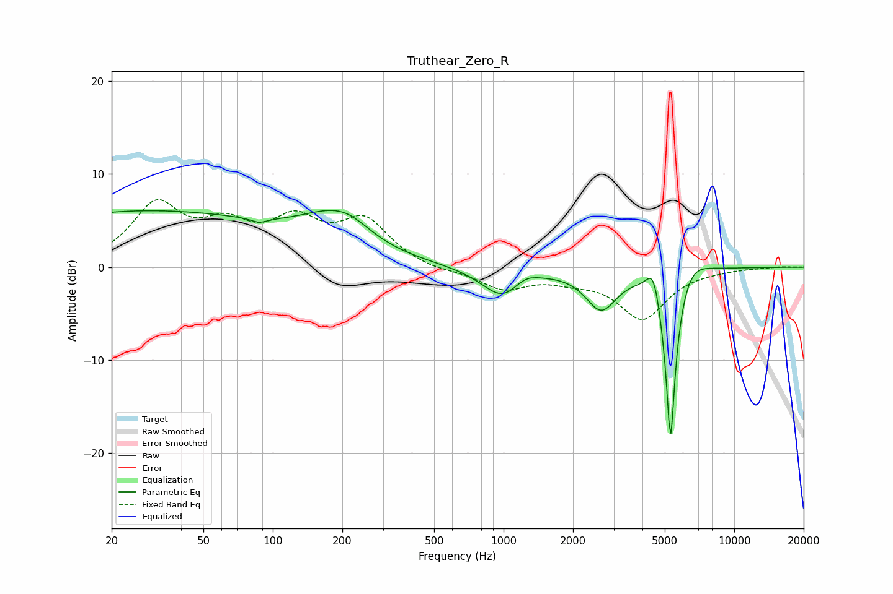

# Truthear_Zero_R
See [usage instructions](https://github.com/jaakkopasanen/AutoEq#usage) for more options and info.

### Parametric EQs
Apply preamp of -6.2 dB when using parametric equalizer.

|   # | Type    |   Fc (Hz) |    Q |   Gain (dB) |
|-----|---------|-----------|------|-------------|
|   1 | Peaking |        27 | 0.22 |         6   |
|   2 | Peaking |        87 | 4.09 |        -0.5 |
|   3 | Peaking |       183 | 0.91 |         3.6 |
|   4 | Peaking |       216 | 1.71 |         0.9 |
|   5 | Peaking |      1003 | 1.54 |        -3.5 |
|   6 | Peaking |      1227 | 2.36 |         1.3 |
|   7 | Peaking |      2648 | 2.12 |        -4.2 |
|   8 | Peaking |      4462 | 4.78 |         3.2 |
|   9 | Peaking |      5296 | 5.77 |       -20   |
|  10 | Peaking |      6351 | 1.98 |         2.4 |

### Fixed Band EQs
When using fixed band (also called graphic) equalizer, apply preamp of **-7.4 dB** (if available) and set gains manually with these parameters.

|   # | Type    |   Fc (Hz) |    Q |   Gain (dB) |
|-----|---------|-----------|------|-------------|
|   1 | Peaking |        31 | 1.41 |         6.4 |
|   2 | Peaking |        62 | 1.41 |         3.6 |
|   3 | Peaking |       125 | 1.41 |         4.3 |
|   4 | Peaking |       250 | 1.41 |         4.7 |
|   5 | Peaking |       500 | 1.41 |        -0.5 |
|   6 | Peaking |      1000 | 1.41 |        -2.2 |
|   7 | Peaking |      2000 | 1.41 |        -1   |
|   8 | Peaking |      4000 | 1.41 |        -5.4 |
|   9 | Peaking |      8000 | 1.41 |        -0.1 |
|  10 | Peaking |     16000 | 1.41 |         0.1 |

### Graphs

