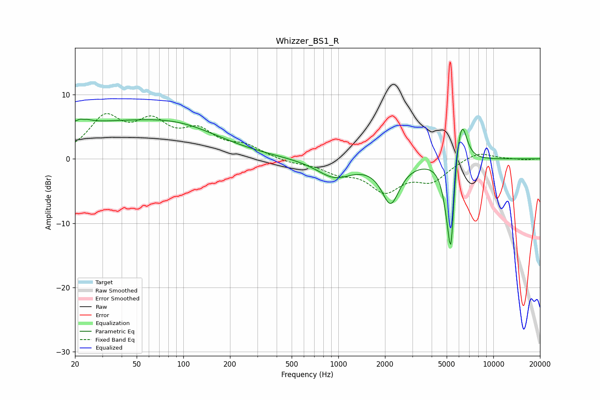

# Whizzer_BS1_R
See [usage instructions](https://github.com/jaakkopasanen/AutoEq#usage) for more options and info.

### Parametric EQs
Apply preamp of -6.3 dB when using parametric equalizer.

|   # | Type    |   Fc (Hz) |    Q |   Gain (dB) |
|-----|---------|-----------|------|-------------|
|   1 | Peaking |        23 | 5.26 |         3.5 |
|   2 | Peaking |        23 | 6    |        -2.9 |
|   3 | Peaking |        29 | 0.19 |         5.4 |
|   4 | Peaking |        98 | 0.58 |         1.6 |
|   5 | Peaking |       944 | 1.22 |        -2.8 |
|   6 | Peaking |      2174 | 2.45 |        -6.5 |
|   7 | Peaking |      5060 | 4.2  |        -3.7 |
|   8 | Peaking |      5329 | 6    |       -14   |
|   9 | Peaking |      5924 | 3.57 |         4.8 |
|  10 | Peaking |      6315 | 4.25 |         4.5 |

### Fixed Band EQs
When using fixed band (also called graphic) equalizer, apply preamp of **-7.1 dB** (if available) and set gains manually with these parameters.

|   # | Type    |   Fc (Hz) |    Q |   Gain (dB) |
|-----|---------|-----------|------|-------------|
|   1 | Peaking |        31 | 1.41 |         6   |
|   2 | Peaking |        62 | 1.41 |         4.8 |
|   3 | Peaking |       125 | 1.41 |         3.7 |
|   4 | Peaking |       250 | 1.41 |         1.7 |
|   5 | Peaking |       500 | 1.41 |        -0.6 |
|   6 | Peaking |      1000 | 1.41 |        -1.7 |
|   7 | Peaking |      2000 | 1.41 |        -4.6 |
|   8 | Peaking |      4000 | 1.41 |        -3.1 |
|   9 | Peaking |      8000 | 1.41 |         1.3 |
|  10 | Peaking |     16000 | 1.41 |        -0.2 |

### Graphs

