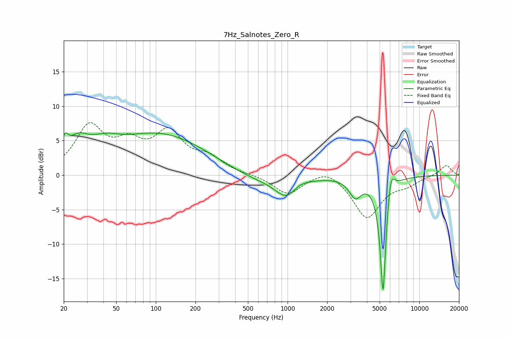

# 7Hz_Salnotes_Zero_R
See [usage instructions](https://github.com/jaakkopasanen/AutoEq#usage) for more options and info.

### Parametric EQs
Apply preamp of -6.2 dB when using parametric equalizer.

|   # | Type    |   Fc (Hz) |    Q |   Gain (dB) |
|-----|---------|-----------|------|-------------|
|   1 | Peaking |        20 | 5.94 |         2.2 |
|   2 | Peaking |        25 | 1.6  |         3.4 |
|   3 | Peaking |        41 | 1.27 |         1.8 |
|   4 | Peaking |       109 | 0.39 |         5.9 |
|   5 | Peaking |       566 | 0.65 |        -1.2 |
|   6 | Peaking |       997 | 1.58 |        -3.1 |
|   7 | Peaking |      1197 | 2.16 |         0.9 |
|   8 | Peaking |      3266 | 3.05 |        -2.7 |
|   9 | Peaking |      5305 | 6    |       -17.7 |
|  10 | Peaking |      6061 | 4.86 |         3.9 |

### Fixed Band EQs
When using fixed band (also called graphic) equalizer, apply preamp of **-7.7 dB** (if available) and set gains manually with these parameters.

|   # | Type    |   Fc (Hz) |    Q |   Gain (dB) |
|-----|---------|-----------|------|-------------|
|   1 | Peaking |        31 | 1.41 |         6.7 |
|   2 | Peaking |        62 | 1.41 |         3.6 |
|   3 | Peaking |       125 | 1.41 |         5.6 |
|   4 | Peaking |       250 | 1.41 |         2.1 |
|   5 | Peaking |       500 | 1.41 |         0.1 |
|   6 | Peaking |      1000 | 1.41 |        -2.8 |
|   7 | Peaking |      2000 | 1.41 |         1.3 |
|   8 | Peaking |      4000 | 1.41 |        -6.1 |
|   9 | Peaking |      8000 | 1.41 |        -1.1 |
|  10 | Peaking |     16000 | 1.41 |         1.5 |

### Graphs

