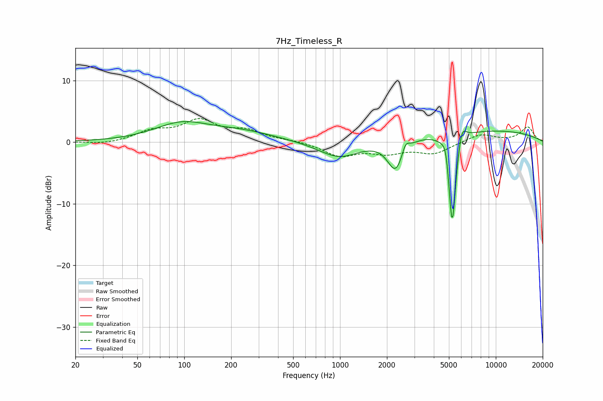

# 7Hz_Timeless_R
See [usage instructions](https://github.com/jaakkopasanen/AutoEq#usage) for more options and info.

### Parametric EQs
Apply preamp of -3.4 dB when using parametric equalizer.

|   # | Type    |   Fc (Hz) |    Q |   Gain (dB) |
|-----|---------|-----------|------|-------------|
|   1 | Peaking |        95 | 0.82 |         2.7 |
|   2 | Peaking |       231 | 0.62 |         1.5 |
|   3 | Peaking |       991 | 1.05 |        -2.8 |
|   4 | Peaking |      2279 | 2.68 |        -5.3 |
|   5 | Peaking |      2635 | 5.88 |         1.8 |
|   6 | Peaking |      4805 | 5.84 |         2.9 |
|   7 | Peaking |      5222 | 5.93 |        -3.8 |
|   8 | Peaking |      5254 | 5.74 |       -12.6 |
|   9 | Peaking |      6036 | 5.08 |         3.2 |
|  10 | Peaking |      7207 | 0.24 |         2   |

### Fixed Band EQs
When using fixed band (also called graphic) equalizer, apply preamp of **-3.9 dB** (if available) and set gains manually with these parameters.

|   # | Type    |   Fc (Hz) |    Q |   Gain (dB) |
|-----|---------|-----------|------|-------------|
|   1 | Peaking |        31 | 1.41 |        -0.4 |
|   2 | Peaking |        62 | 1.41 |         1.6 |
|   3 | Peaking |       125 | 1.41 |         3.2 |
|   4 | Peaking |       250 | 1.41 |         1.6 |
|   5 | Peaking |       500 | 1.41 |         0.2 |
|   6 | Peaking |      1000 | 1.41 |        -2.2 |
|   7 | Peaking |      2000 | 1.41 |        -1.5 |
|   8 | Peaking |      4000 | 1.41 |        -1.8 |
|   9 | Peaking |      8000 | 1.41 |         1.3 |
|  10 | Peaking |     16000 | 1.41 |         2.4 |

### Graphs

